# JuicePOS Cashier System - Implementation Plan Document

## Table of Contents
1. [Project Overview](#project-overview)
2. [Technology Stack](#technology-stack)
3. [Database Schema](#database-schema)
4. [Current Implementation Status](#current-implementation-status)
5. [Missing Features & Implementation Plan](#missing-features--implementation-plan)
6. [Detailed Flow Diagrams](#detailed-flow-diagrams)
7. [API Endpoints](#api-endpoints)
8. [File Structure](#file-structure)

---

## Project Overview

### Purpose
JuicePOS is a **Point of Sale (POS) and Inventory Management System** designed for juice shops and cafes. It handles:
- Product catalog management
- Bill of Materials (BOM) based inventory tracking
- Order processing and payments
- Automatic stock deduction based on recipes
- Sales reporting and analytics

### Core Features
1. **POS System** - Cashier interface for processing sales
2. **Product Management** - Catalog and recipe (BOM) management
3. **Inventory Management** - Raw material stock tracking
4. **Sales Reports** - Analytics and transaction history
5. **Settings** - System configuration

---

## Technology Stack

```
┌─────────────────────────────────────────────────────────┐
│                    FRONTEND LAYER                        │
├─────────────────────────────────────────────────────────┤
│  Alpine.js (Reactive UI)  │  Tailwind CSS 4 (Styling)   │
│  Blade Templates (Laravel) │  Vite (Asset Bundling)     │
└─────────────────────────────────────────────────────────┘
                            ↓ HTTP
┌─────────────────────────────────────────────────────────┐
│                   BACKEND LAYER                          │
├─────────────────────────────────────────────────────────┤
│  Laravel 12 Framework  │  PHP 8.2+                      │
│  Controllers            │  Middleware (Auth, CSRF)      │
│  Validation             │  Database Transactions        │
└─────────────────────────────────────────────────────────┘
                            ↓
┌─────────────────────────────────────────────────────────┐
│                    DATA LAYER                            │
├─────────────────────────────────────────────────────────┤
│  MariaDB / MySQL        │  Eloquent ORM                 │
│  Migrations             │  Models & Relationships       │
└─────────────────────────────────────────────────────────┘
```

---

## Database Schema

### Entity Relationships

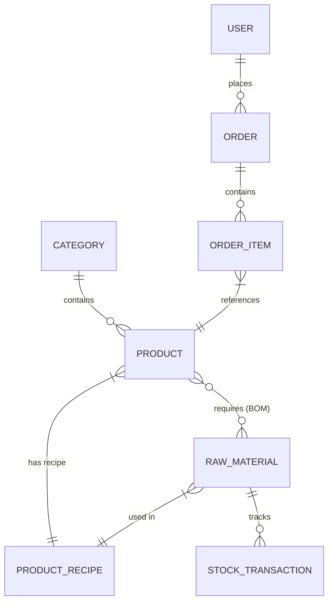

### Tables

| Table | Purpose | Key Fields |
|-------|---------|------------|
| `users` | Authentication | id, name, email, password |
| `categories` | Product grouping | id, name, type |
| `products` | Sellable items | id, category_id, name, price, image, is_active |
| `raw_materials` | Inventory items | id, name, unit, current_stock, min_stock_level |
| `product_recipes` | BOM definitions | id, product_id, raw_material_id, quantity_required |
| `orders` | Customer orders | id, user_id, total_amount, payment_method, status |
| `order_items` | Order line items | id, order_id, product_id, quantity, price, subtotal |
| `stock_transactions` | Inventory movements | id, raw_material_id, type, quantity, description, reference_id |

---

## Current Implementation Status

### ✅ Completed Features

| Feature | Status | Location |
|---------|--------|----------|
| POS Interface | ✅ Complete | `/pos` |
| Product Search (by name) | ✅ Complete | [pos/index.blade.php:60-62](resources/views/pos/index.blade.php#L60) |
| Add to Cart | ✅ Complete | [pos/index.blade.php:465-476](resources/views/pos/index.blade.php#L465) |
| Checkout Modal | ✅ Complete | [pos/index.blade.php:301-414](resources/views/pos/index.blade.php#L301) |
| Payment Methods (Cash, QRIS, Debit) | ✅ Complete | [pos/index.blade.php:326-364](resources/views/pos/index.blade.php#L326) |
| BOM Stock Deduction | ✅ Complete | [PosController.php:54-65](app/Http/Controllers/PosController.php#L54) |
| Product List View | ✅ Complete | `/admin/products` |
| Stock Levels View | ✅ Complete | `/admin/raw-materials` |
| Dashboard Metrics | ✅ Complete | `/admin` |

### ❌ Missing Features

| Feature | Priority | Reference |
|---------|----------|-----------|
| Custom Login Page | High | Flow: Login → Dashboard/POS |
| Settings Module | High | Flow: Settings (from Dashboard) |
| Purchase/Restock Form | Medium | Flow: Stock → Purchase/Restock |
| Receipt Printing | Medium | Flow: Payment & Receipt |
| Sales Reports Page | Medium | Flow: Sales Reports |
| Stock History Page | Low | Flow: View Stock Levels → History |
| Products CRUD Routes | High | Product Management flow |
| Raw Materials CRUD Routes | High | Stock Management flow |
| Barcode Search | Low | POS Flow: Search Item |

---

## Missing Features & Implementation Plan

### 1. Custom Login Page

**Flow Diagram Reference:**
```
┌──────────────┐
│ Login Page   │ ──→ Dashboard / POS
└──────────────┘
```

**Implementation Details:**

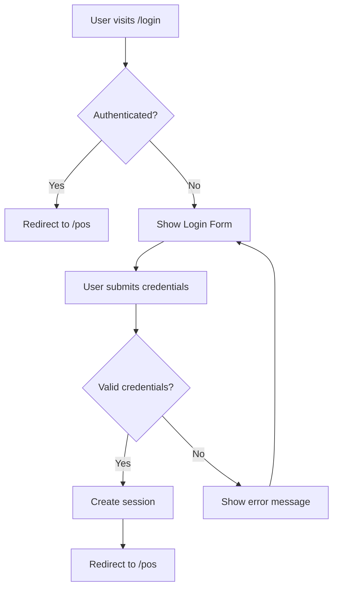

**Files to Create:**
- `resources/views/auth/login.blade.php`
- `app/Http/Controllers/Auth/LoginController.php`

**Routes to Add:**
```php
// routes/web.php
Route::get('/login', [LoginController::class, 'showLoginForm'])->name('login');
Route::post('/login', [LoginController::class, 'login']);
Route::post('/logout', [LoginController::class, 'logout'])->name('logout');
```

**Database Changes:**
- None (uses existing `users` table)

---

### 2. Settings Module

**Flow Diagram Reference:**
```
Dashboard / POS ──→ Settings
                  ├── User Roles
                  ├── Payment Methods
                  ├── Tax Rates
                  └── Store Info
```

**Implementation Details:**

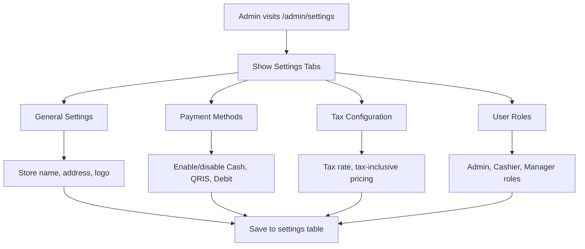

**Files to Create:**
- `resources/views/admin/settings/index.blade.php`
- `app/Http/Controllers/SettingsController.php`
- `database/migrations/xxxx_create_settings_table.php`

**Routes to Add:**
```php
Route::get('/admin/settings', [SettingsController::class, 'index'])->name('admin.settings.index');
Route::post('/admin/settings', [SettingsController::class, 'update'])->name('admin.settings.update');
```

**Database Changes:**
```sql
CREATE TABLE settings (
    id BIGINT UNSIGNED AUTO_INCREMENT PRIMARY KEY,
    key VARCHAR(255) UNIQUE,
    value JSON,
    created_at TIMESTAMP,
    updated_at TIMESTAMP
);
```

**Default Settings:**
```json
{
    "store_name": "JuicePOS",
    "tax_rate": 8,
    "payment_methods": ["cash", "qris", "debit"],
    "currency": "USD",
    "receipt_header": "Thank you for visiting!",
    "receipt_footer": "Please come again!"
}
```

---

### 3. Purchase/Restock Feature

**Flow Diagram Reference:**
```
Stock / Inventory ──→ Purchase / Restock
                    ├── Select Material
                    ├── Enter Quantity
                    ├── Supplier Info
                    └── Record Transaction
```

**Implementation Details:**

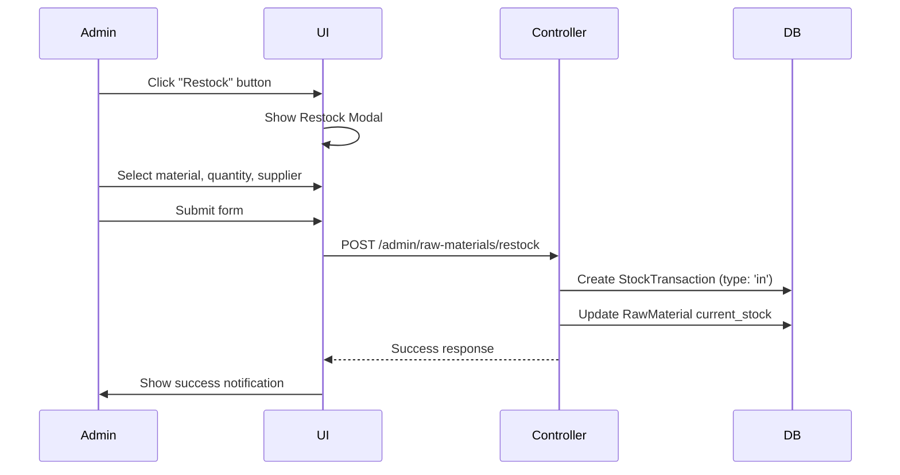

**Files to Modify:**
- `app/Http/Controllers/AdminRawMaterialController.php` - Add `restock()` method
- `resources/views/admin/raw-materials/index.blade.php` - Add Restock button/modal

**Routes to Add:**
```php
Route::post('/admin/raw-materials/{id}/restock', [AdminRawMaterialController::class, 'restock'])
    ->name('admin.raw-materials.restock');
```

**Database Model - StockTransaction:**
```php
// New fields for purchase
Schema::table('stock_transactions', function (Blueprint $table) {
    $table->string('supplier')->nullable();
    $table->decimal('unit_cost', 10, 2)->nullable();
    $table->decimal('total_cost', 10, 2)->nullable();
});
```

**Restock Form Fields:**
- Material (dropdown)
- Quantity (number input)
- Supplier (text input)
- Unit Cost (decimal input)
- Notes (textarea)

---

### 4. Receipt Printing

**Flow Diagram Reference:**
```
Payment & Receipt ──→ Generate Receipt
                   ├── Print Thermal Receipt
                   ├── Save to Orders
                   └── Show Success
```

**Implementation Details:**

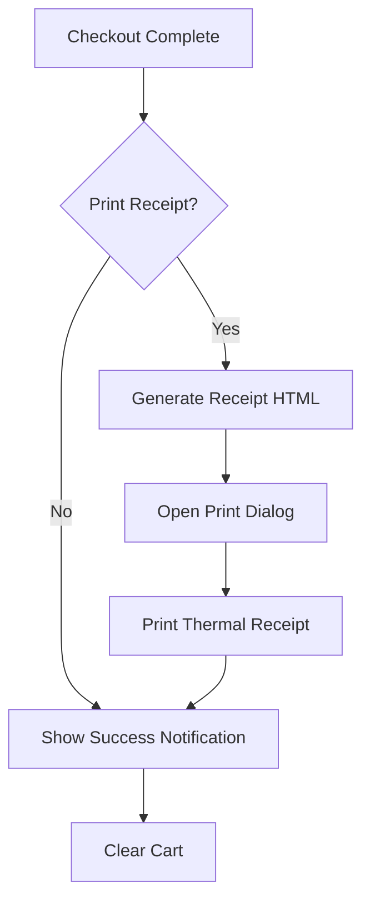

**Files to Create:**
- `resources/views/receipt/print.blade.php` - Thermal receipt template
- `app/Http/Controllers/ReceiptController.php`

**Routes to Add:**
```php
Route::get('/receipt/{order}', [ReceiptController::class, 'show'])->name('receipt.show');
Route::post('/receipt/{order}/print', [ReceiptController::class, 'print'])->name('receipt.print');
```

**Database Changes:**
```sql
ALTER TABLE orders ADD COLUMN print_receipt BOOLEAN DEFAULT TRUE;
ALTER TABLE orders ADD COLUMN cash_received DECIMAL(10,2) DEFAULT NULL;
ALTER TABLE orders ADD COLUMN change_return DECIMAL(10,2) DEFAULT NULL;
```

**Receipt Template Structure:**
```
┌─────────────────────────────────┐
│     JUICEPOS                    │
│   123 Juice Street              │
│   Tel: 555-0123                 │
├─────────────────────────────────┤
│ Order #: ORD-001                │
│ Date: 2024-01-15 14:30          │
│ Cashier: John Doe               │
├─────────────────────────────────┤
│ Item           Qty    Price     │
│ ─────────────────────────────   │
│ Orange Juice    2    $10.00     │
│ Mango Smoothie  1    $8.50      │
├─────────────────────────────────┤
│ Subtotal:            $18.50     │
│ Tax (8%):             $1.48     │
│ ─────────────────────────────   │
│ TOTAL:               $19.98     │
│                                  │
│ Paid: CASH           $20.00     │
│ Change:              $0.02      │
├─────────────────────────────────┤
│   Thank you for visiting!       │
│      Please come again!         │
└─────────────────────────────────┘
```

---

### 5. Sales Reports Page

**Flow Diagram Reference:**
```
Dashboard / POS ──→ Sales Reports
                  ├── Date Range Filter
                  ├── Revenue Charts
                  ├── Top Products
                  ├── Payment Method Breakdown
                  └── Export to CSV/PDF
```

**Implementation Details:**

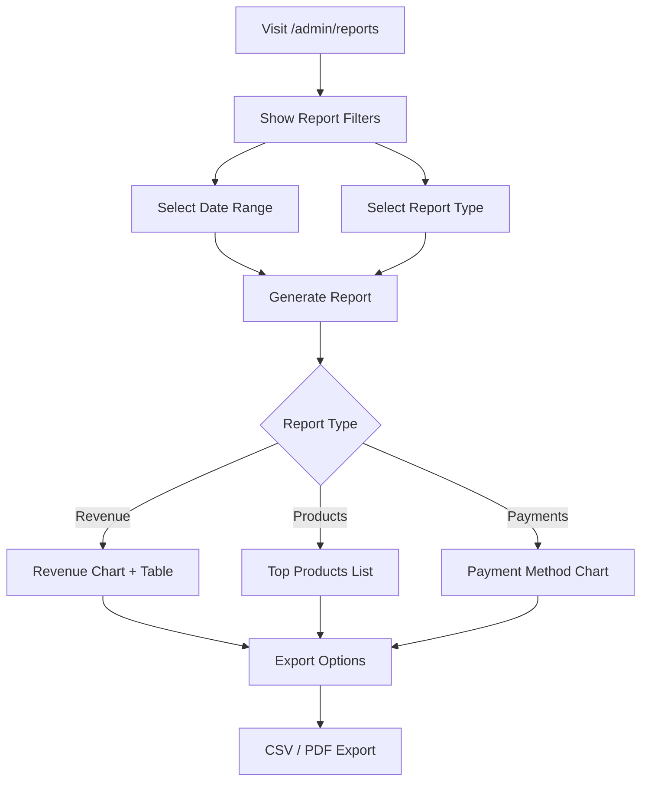

**Files to Create:**
- `resources/views/admin/reports/index.blade.php`
- `resources/views/admin/reports/revenue.blade.php`
- `resources/views/admin/reports/products.blade.php`
- `resources/views/admin/reports/payments.blade.php`
- `app/Http/Controllers/ReportsController.php`

**Routes to Add:**
```php
Route::get('/admin/reports', [ReportsController::class, 'index'])->name('admin.reports.index');
Route::get('/admin/reports/revenue', [ReportsController::class, 'revenue'])->name('admin.reports.revenue');
Route::get('/admin/reports/products', [ReportsController::class, 'products'])->name('admin.reports.products');
Route::get('/admin/reports/payments', [ReportsController::class, 'payments'])->name('admin.reports.payments');
Route::get('/admin/reports/export/{type}', [ReportsController::class, 'export'])->name('admin.reports.export');
```

**Report Features:**
1. **Revenue Report**
   - Daily/Weekly/Monthly revenue
   - Line chart visualization
   - Comparison with previous period

2. **Products Report**
   - Top selling products
   - Quantity sold per product
   - Revenue per product

3. **Payments Report**
   - Payment method breakdown
   - Pie chart visualization
   - Transaction counts

4. **Export Options**
   - CSV format
   - PDF format (using DOMPDF or Snappy)

---

### 6. Stock Transaction History Page

**Flow Diagram Reference:**
```
Dashboard (Stock History link) ──→ /admin/stock-transactions
                                ├── Filter by Date
                                ├── Filter by Type (in/out/adjustment)
                                ├── Filter by Material
                                └── Export CSV
```

**Implementation Details:**

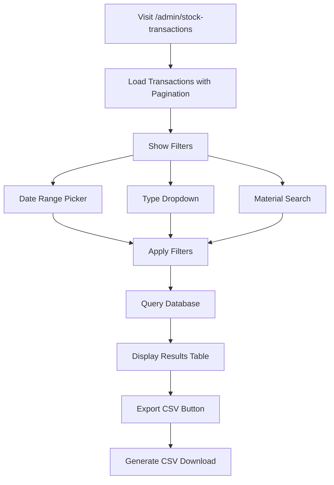

**Files to Create:**
- `resources/views/admin/stock-transactions/index.blade.php`
- `app/Http/Controllers/StockTransactionController.php`

**Routes to Add:**
```php
Route::get('/admin/stock-transactions', [StockTransactionController::class, 'index'])
    ->name('admin.stock-transactions.index');
Route::get('/admin/stock-transactions/export', [StockTransactionController::class, 'export'])
    ->name('admin.stock-transactions.export');
```

**Controller Logic:**
```php
public function index(Request $request)
{
    $query = StockTransaction::with('rawMaterial');

    if ($request->filled('date_from')) {
        $query->whereDate('created_at', '>=', $request->date_from);
    }
    if ($request->filled('date_to')) {
        $query->whereDate('created_at', '<=', $request->date_to);
    }
    if ($request->filled('type')) {
        $query->where('type', $request->type);
    }
    if ($request->filled('material_id')) {
        $query->where('raw_material_id', $request->material_id);
    }

    return view('admin.stock-transactions.index', [
        'transactions' => $query->latest()->paginate(50)
    ]);
}
```

---

### 7. Products CRUD Routes

**Flow Diagram Reference:**
```
Product Management ──→ Create Product
                    ├── Edit Product
                    ├── Delete Product
                    └── Manage Recipe (BOM)
```

**Implementation Details:**

```mermaid
flowchart TD
    A[Admin Product Management] --> B[List Products]
    B --> C[Click 'Add New']
    C --> D[Show Create Form]
    D --> E[Fill Details + Upload Image]
    E --> F[Manage Recipe (BOM)]
    F --> G[Select Raw Materials]
    G --> H[Set Quantities]
    H --> I[Save Product + Recipe]

    B --> J[Click Edit on Product]
    J --> K[Show Edit Form]
    K --> L[Update Details]
    L --> M[Update Recipe]
    M --> N[Save Changes]

    B --> O[Click Delete]
    O --> P[Confirm Dialog]
    P -->|Yes| Q[Soft Delete Product]
```

**Files to Modify:**
- `routes/web.php` - Add CRUD routes
- `app/Http/Controllers/AdminProductController.php` - Add CRUD methods
- Create: `resources/views/admin/products/create.blade.php`
- Create: `resources/views/admin/products/edit.blade.php`

**Routes to Add:**
```php
Route::get('/admin/products/create', [AdminProductController::class, 'create'])
    ->name('admin.products.create');
Route::post('/admin/products', [AdminProductController::class, 'store'])
    ->name('admin.products.store');
Route::get('/admin/products/{id}/edit', [AdminProductController::class, 'edit'])
    ->name('admin.products.edit');
Route::put('/admin/products/{id}', [AdminProductController::class, 'update'])
    ->name('admin.products.update');
Route::delete('/admin/products/{id}', [AdminProductController::class, 'destroy'])
    ->name('admin.products.destroy');
```

**Controller Methods:**
```php
public function create()
{
    $categories = Category::all();
    $rawMaterials = RawMaterial::all();
    return view('admin.products.create', compact('categories', 'rawMaterials'));
}

public function store(Request $request)
{
    // Validate
    $validated = $request->validate([
        'category_id' => 'required|exists:categories,id',
        'name' => 'required|string|max:255',
        'price' => 'required|numeric|min:0',
        'image' => 'nullable|image',
        'is_active' => 'boolean',
        'recipes' => 'array',
        'recipes.*.raw_material_id' => 'required|exists:raw_materials,id',
        'recipes.*.quantity_required' => 'required|numeric|min:0',
    ]);

    DB::transaction(function () use ($request) {
        $product = Product::create($request->only(['category_id', 'name', 'price', 'is_active']));

        if ($request->hasFile('image')) {
            $product->image = $request->file('image')->store('products', 'public');
            $product->save();
        }

        foreach ($request->recipes as $recipe) {
            $product->productRecipes()->create($recipe);
        }
    });

    return redirect()->route('admin.products.index');
}
```

---

### 8. Raw Materials CRUD Routes

**Flow Diagram Reference:**
```
Stock / Inventory ──→ Create Material
                    ├── Edit Material
                    ├── Delete Material
                    └── Restock
```

**Implementation Details:**

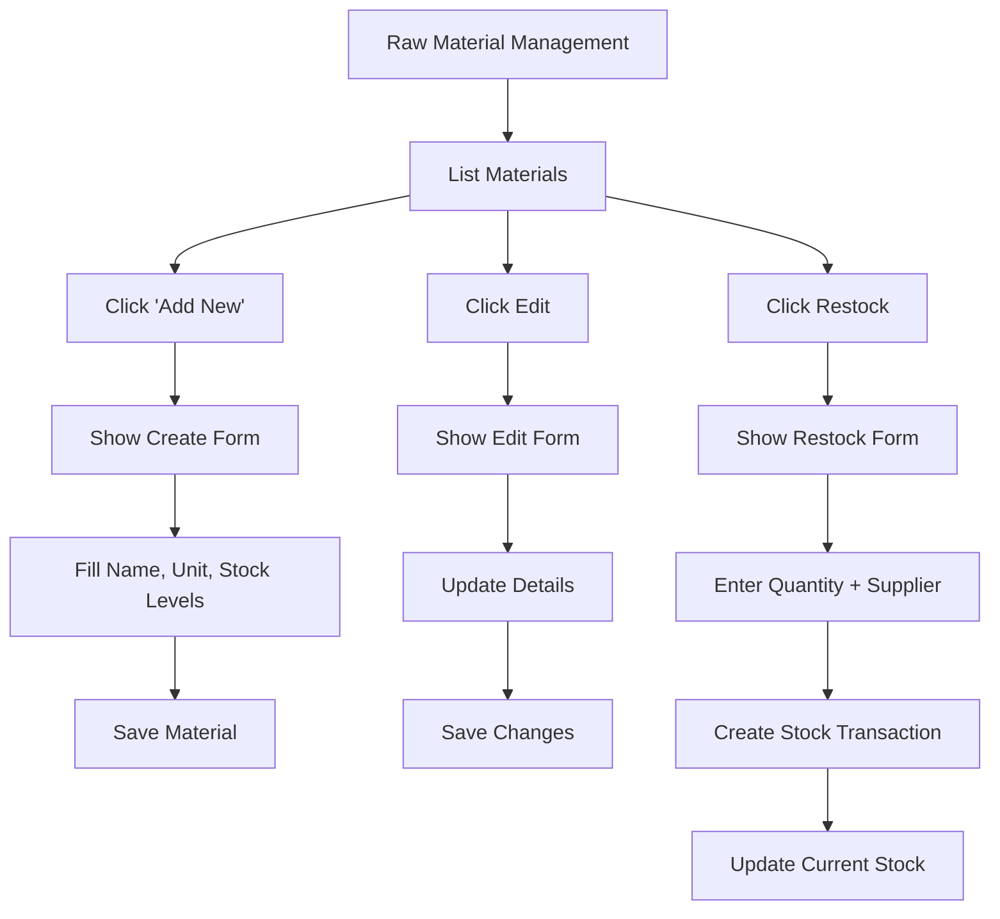

**Files to Modify:**
- `routes/web.php` - Add CRUD routes
- `app/Http/Controllers/AdminRawMaterialController.php` - Add CRUD methods
- Create: `resources/views/admin/raw-materials/create.blade.php`
- Create: `resources/views/admin/raw-materials/edit.blade.php`

**Routes to Add:**
```php
Route::get('/admin/raw-materials/create', [AdminRawMaterialController::class, 'create'])
    ->name('admin.raw-materials.create');
Route::post('/admin/raw-materials', [AdminRawMaterialController::class, 'store'])
    ->name('admin.raw-materials.store');
Route::get('/admin/raw-materials/{id}/edit', [AdminRawMaterialController::class, 'edit'])
    ->name('admin.raw-materials.edit');
Route::put('/admin/raw-materials/{id}', [AdminRawMaterialController::class, 'update'])
    ->name('admin.raw-materials.update');
Route::delete('/admin/raw-materials/{id}', [AdminRawMaterialController::class, 'destroy'])
    ->name('admin.raw-materials.destroy');
Route::post('/admin/raw-materials/{id}/restock', [AdminRawMaterialController::class, 'restock'])
    ->name('admin.raw-materials.restock');
```

---

### 9. Barcode/SKU Search

**Flow Diagram Reference:**
```
POS Flow ──→ Search Item
           ├── By Name
           ├── By Barcode/SKU
           └── Keyboard Shortcuts
```

**Implementation Details:**

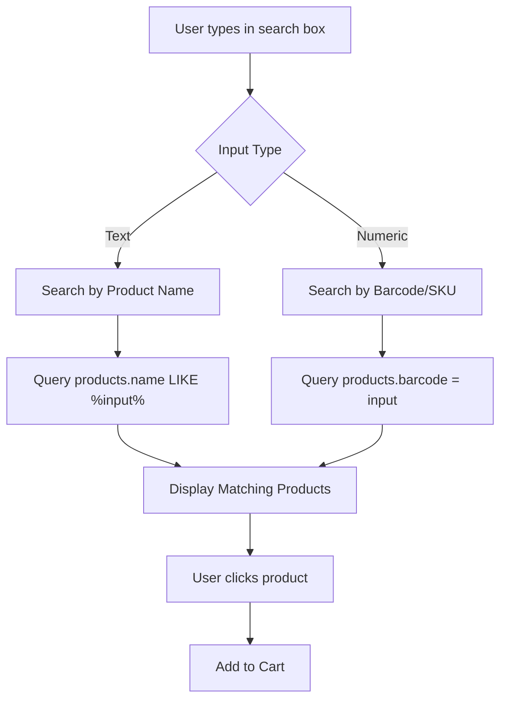

**Files to Modify:**
- `database/migrations/xxxx_add_barcode_to_products_table.php`
- `resources/views/pos/index.blade.php` - Update search logic
- `app/Http/Controllers/PosController.php` - Add barcode search endpoint

**Database Changes:**
```sql
ALTER TABLE products ADD COLUMN barcode VARCHAR(50) UNIQUE AFTER name;
ALTER TABLE products ADD COLUMN sku VARCHAR(50) UNIQUE AFTER barcode;
```

**Search Logic Update:**
```javascript
// In pos/index.blade.php
function pos() {
    return {
        search: '',
        searchByBarcode: false,

        async searchProduct() {
            if (/^\d+$/.test(this.search)) {
                // Numeric input - search by barcode/SKU
                this.searchByBarcode = true;
                const response = await axios.get(`/api/products/search?barcode=${this.search}`);
                return response.data;
            } else {
                // Text input - search by name
                this.searchByBarcode = false;
                return this.products.filter(p =>
                    p.name.toLowerCase().includes(this.search.toLowerCase())
                );
            }
        }
    }
}
```

**API Endpoint:**
```php
// routes/api.php
Route::get('/products/search', [ProductController::class, 'search']);

// Controller
public function search(Request $request)
{
    if ($request->filled('barcode')) {
        return Product::where('barcode', $request->barcode)->first();
    }
    if ($request->filled('sku')) {
        return Product::where('sku', $request->sku)->first();
    }
    return Product::where('name', 'like', "%{$request->q}%")->get();
}
```

---

## Detailed Flow Diagrams

### Complete User Flow

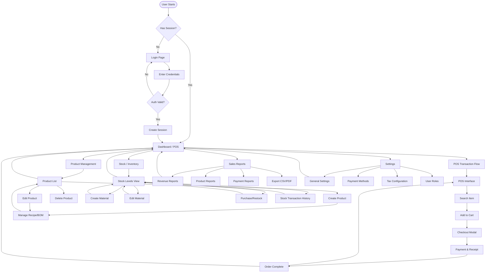

### Checkout Process (BOM Stock Deduction)

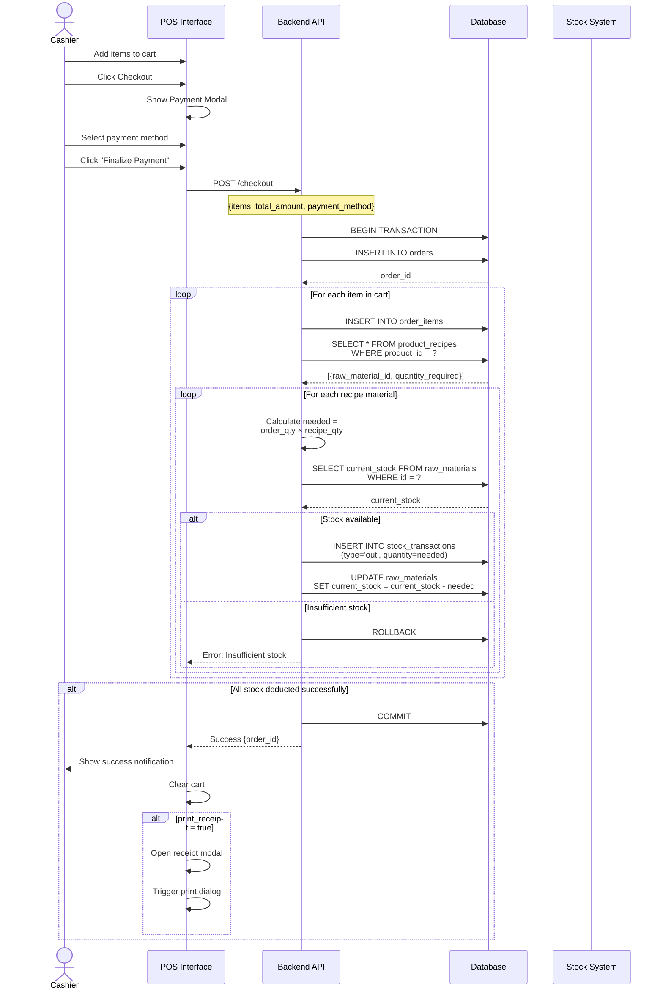

---

## API Endpoints

### Public Routes
| Method | Endpoint | Description |
|--------|----------|-------------|
| GET | `/` | Redirect to `/pos` |
| GET | `/pos` | POS interface |
| POST | `/checkout` | Process checkout |
| GET | `/login` | Login page |
| POST | `/login` | Authenticate |
| POST | `/logout` | Logout |

### Authenticated Admin Routes
| Method | Endpoint | Description |
|--------|----------|-------------|
| GET | `/admin` | Dashboard |
| GET | `/admin/settings` | Settings page |
| POST | `/admin/settings` | Update settings |
| GET | `/admin/products` | Products list |
| GET | `/admin/products/create` | Create product form |
| POST | `/admin/products` | Store product |
| GET | `/admin/products/{id}/edit` | Edit product form |
| PUT | `/admin/products/{id}` | Update product |
| DELETE | `/admin/products/{id}` | Delete product |
| GET | `/admin/raw-materials` | Raw materials list |
| GET | `/admin/raw-materials/create` | Create material form |
| POST | `/admin/raw-materials` | Store material |
| GET | `/admin/raw-materials/{id}/edit` | Edit material form |
| PUT | `/admin/raw-materials/{id}` | Update material |
| DELETE | `/admin/raw-materials/{id}` | Delete material |
| POST | `/admin/raw-materials/{id}/restock` | Restock material |
| GET | `/admin/reports` | Reports index |
| GET | `/admin/reports/revenue` | Revenue report |
| GET | `/admin/reports/products` | Products report |
| GET | `/admin/reports/payments` | Payments report |
| GET | `/admin/reports/export/{type}` | Export report |
| GET | `/admin/stock-transactions` | Stock transaction history |
| GET | `/admin/stock-transactions/export` | Export stock history |

### API Routes (for AJAX)
| Method | Endpoint | Description |
|--------|----------|-------------|
| GET | `/api/products/search` | Search products (name/barcode/SKU) |
| GET | `/api/products` | List products (JSON) |
| GET | `/api/receipt/{order}` | Get receipt data |

---

## File Structure

```
d:\Cashier/
├── app/
│   ├── Http/
│   │   ├── Controllers/
│   │   │   ├── Auth/
│   │   │   │   ├── LoginController.php          # NEW
│   │   │   │   └── RegisteredUserController.php
│   │   │   ├── PosController.php               # ✅ Existing
│   │   │   ├── AdminProductController.php      # ➕ Add CRUD methods
│   │   │   ├── AdminRawMaterialController.php  # ➕ Add CRUD + restock
│   │   │   ├── DashboardController.php         # ✅ Existing
│   │   │   ├── SettingsController.php          # NEW
│   │   │   ├── ReportsController.php           # NEW
│   │   │   ├── StockTransactionController.php  # NEW
│   │   │   ├── ReceiptController.php           # NEW
│   │   │   └── ProductController.php           # NEW (API)
│   │   └── Middleware/
│   ├── Models/
│   │   ├── User.php                            # ✅ Existing
│   │   ├── Category.php                        # ✅ Existing
│   │   ├── Product.php                         # ➕ Add barcode, sku
│   │   ├── RawMaterial.php                     # ✅ Existing
│   │   ├── ProductRecipe.php                   # ✅ Existing
│   │   ├── Order.php                           # ➕ Add print_receipt, cash_received, change_return
│   │   ├── OrderItem.php                       # ✅ Existing
│   │   ├── StockTransaction.php                # ➕ Add supplier, unit_cost, total_cost
│   │   └── Setting.php                         # NEW
│   └── Services/
│       └── ReceiptService.php                  # NEW
├── resources/
│   ├── views/
│   │   ├── auth/
│   │   │   └── login.blade.php                 # NEW
│   │   ├── pos/
│   │   │   └── index.blade.php                 # ➕ Update for barcode search
│   │   ├── receipt/
│   │   │   └── print.blade.php                 # NEW
│   │   ├── admin/
│   │   │   ├── dashboard.blade.php             # ✅ Existing
│   │   │   ├── settings/
│   │   │   │   └── index.blade.php             # NEW
│   │   │   ├── products/
│   │   │   │   ├── index.blade.php             # ✅ Existing
│   │   │   │   ├── create.blade.php            # NEW
│   │   │   │   └── edit.blade.php              # NEW
│   │   │   ├── raw-materials/
│   │   │   │   ├── index.blade.php             # ➕ Add restock modal
│   │   │   │   ├── create.blade.php            # NEW
│   │   │   │   └── edit.blade.php              # NEW
│   │   │   ├── reports/
│   │   │   │   ├── index.blade.php             # NEW
│   │   │   │   ├── revenue.blade.php           # NEW
│   │   │   │   ├── products.blade.php          # NEW
│   │   │   │   └── payments.blade.php          # NEW
│   │   │   └── stock-transactions/
│   │   │       └── index.blade.php             # NEW
│   │   └── layouts/
│   │       └── admin.blade.php                 # ✅ Existing
│   └── js/
│       └── app.js                              # ➕ Add receipt printing
├── routes/
│   ├── web.php                                 # ➕ Add new routes
│   └── api.php                                 # NEW
├── database/
│   └── migrations/
│       ├── 0001_01_01_000000_create_users_table.php
│       ├── 2026_01_10_171700_create_categories_table.php
│       ├── 2026_01_10_171806_create_raw_materials_table.php
│       ├── 2026_01_10_171807_create_products_table.php
│       ├── 2026_01_10_171807_create_stock_transactions_table.php
│       ├── 2026_01_10_171810_create_product_recipes_table.php
│       ├── 2026_01_10_173150_create_orders_table.php
│       ├── 2026_01_10_173200_create_order_items_table.php
│       ├── xxxx_create_settings_table.php      # NEW
│       ├── xxxx_add_barcode_to_products_table.php  # NEW
│       ├── xxxx_add_print_receipt_to_orders_table.php  # NEW
│       └── xxxx_add_purchase_fields_to_stock_transactions.php  # NEW
└── tests/
    ├── Feature/
    │   ├── PosCheckoutTest.php                 # NEW
    │   ├── ProductCRUDTest.php                 # NEW
    │   ├── RawMaterialCRUDTest.php             # NEW
    │   └── ReceiptGenerationTest.php           # NEW
    └── Unit/
        ├── StockDeductionTest.php              # NEW
        └── BOMCalculationTest.php              # NEW
```

---

## Implementation Priority

### Phase 1: Critical (Must Have)
1. ✅ POS Checkout Flow - Already implemented
2. ✅ BOM Stock Deduction - Already implemented
3. **Login Page** - Required for security
4. **Products CRUD Routes** - Required for product management
5. **Raw Materials CRUD Routes** - Required for inventory management

### Phase 2: High Priority
6. **Settings Module** - Required for configuration
7. **Receipt Printing** - Required for customer receipts
8. **Purchase/Restock Feature** - Required for inventory management

### Phase 3: Medium Priority
9. **Sales Reports Page** - Required for business analytics
10. **Stock Transaction History** - Required for audit trail

### Phase 4: Low Priority (Nice to Have)
11. **Barcode/SKU Search** - Enhancement for faster checkout
12. **Export Functionality** - Enhancement for reports
13. **Advanced Filtering** - Enhancement for all list views

---

## Testing Checklist

### Unit Tests
- [ ] BOM calculation accuracy
- [ ] Stock deduction logic
- [ ] Tax calculation
- [ ] Change calculation

### Feature Tests
- [ ] Login/logout flow
- [ ] Checkout process
- [ ] Stock deduction on checkout
- [ ] Product CRUD operations
- [ ] Raw material CRUD operations
- [ ] Restock functionality
- [ ] Receipt generation

### Integration Tests
- [ ] Complete POS flow
- [ ] Admin panel access
- [ ] Settings persistence

---

## Security Considerations

1. **Authentication**
   - All admin routes require `auth` middleware
   - Session timeout configuration
   - Password hashing (bcrypt)

2. **Authorization**
   - Role-based access control (Admin, Manager, Cashier)
   - Only admins can access Settings

3. **Input Validation**
   - Validate all form inputs
   - Sanitize file uploads
   - Prevent SQL injection (use Eloquent)

4. **CSRF Protection**
   - All POST requests require CSRF token
   - Enabled by default in Laravel

---

## Deployment Checklist

- [ ] Set environment variables (.env)
- [ ] Run database migrations
- [ ] Seed initial data (categories, settings)
- [ ] Configure storage link for images
- [ ] Set queue worker (if using queues)
- [ ] Enable HTTPS
- [ ] Configure backup strategy
- [ ] Set up monitoring/logging

---

*Document Version: 1.0*
*Last Updated: January 11, 2026*
*Author: Claude Code*
