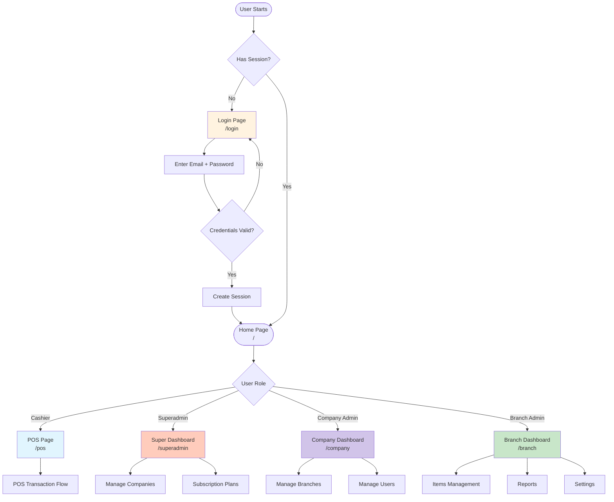
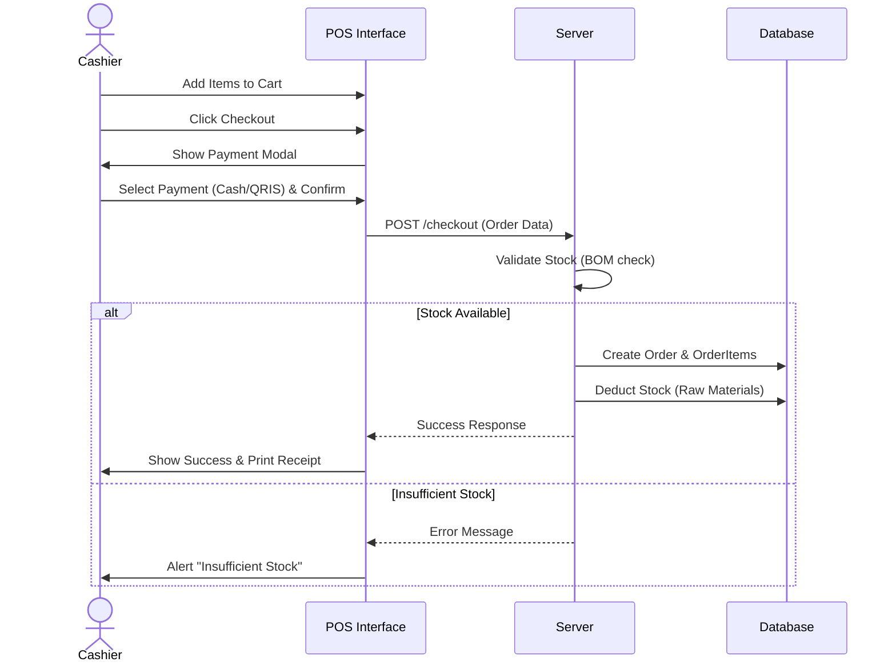

# Product Requirements Document (PRD) - JuicePOS / Cashier System

## 1. Project Overview
**Project Name:** JuicePOS (Cashier System)
**Type:** Web-based Point of Sales (POS) & Inventory Management System
**Architecture:** Multi-Tenant (Superadmin > Company > Branch)

### Executive Summary
This project is a comprehensive Point of Sale (POS) and inventory management system designed for retail and F&B businesses. It supports a hierarchical structure allowing Superadmins to manage multiple companies, Company Admins to manage branches, and Branch Managers/Cashiers to handle daily operations.

## 2. Technology Stack
*   **Framework:** Laravel 12.0 (PHP 8.2+)
*   **Frontend:** Blade Templates, Alpine.js, Tailwind CSS
*   **Admin Panel:** Filament
*   **Database:** MariaDB/MySQL
*   **PDF Generation:** barryvdh/laravel-dompdf
*   **Role Management:** spatie/laravel-permission

## 3. User Roles & Permissions

| Role | Responsibility | Key Features Access |
| :--- | :--- | :--- |
| **Superadmin** | System Owner | Manage Companies, Subscription Plans, Global Payments, Switch Context. |
| **Company Admin** | Business Owner | Manage Branches, Company Users, Company Subscriptions, Dashboard. |
| **Branch Admin** | Store Manager | Manage Items (Products/Raw Materials), Reports, Stock, Settings, Branch Users. |
| **Cashier** | Front-line Staff | POS Interface, Process Orders, Print Receipts. |

## 4. Key Features

### 4.1 Point of Sale (POS)
*   **Transactions:** Process sales with efficient cart management.
*   **Payment Methods:** Support for Cash, QRIS, and Debit payments.
*   **Receipts:** Thermal receipt printing (Normal, Kitchen, Table).
*   **Pending Orders:** Ability to save and resume orders (e.g., for restaurant tables).
*   **Search:** Quick product lookup by name or barcode.

### 4.2 Inventory & Product Management
*   **Unified Items:** Management of Products (sellable) and Raw Materials (consumable).
*   **BOM (Bill of Materials):** Define recipes for products to auto-deduct raw materials upon sale.
*   **Stock Management:**
    *   Stock Adjustments (Lost/Damaged).
    *   Restocking (Purchase Orders).
    *   Low Stock Alerts.
*   **Categories:** Organize items into categories.

### 4.3 Reporting & Analytics
*   **Sales Reports:** transaction history, revenue analysis.
*   **Inventory Reports:** Stock levels, valuation, movement history.
*   **Export:** Capability to export reports to PDF and Excel/CSV.
*   **Dashboard:** Visual metrics for daily performance (Revenue, Orders, Top Items).

### 4.4 Multi-Tenancy & Subscriptions
*   **Hierarchy:** Clear separation of data between companies and branches.
*   **Subscriptions:** Companies purchase plans to activate branches/features.
*   **Context Switching:** Superadmins can "login as" company admins for support.

## 5. System Flows

### 5.1 High-Level User Journey

### 5.2 POS Transaction Process

### 5.3 Inventory Restock Flow

## 6. Detailed Requirements

### 6.1 Authentication
*   **Login:** Email/Password based.
*   **Redirects:**
    *   Cashiers -> `/pos`
    *   Admins -> Respective Dashboards
*   **Security:** Role-based access control (RBAC) middleware.

### 6.2 POS Interface
*   **Layout:** Full-screen optimized.
*   **Left Panel:** Product Grid with Categories.
*   **Right Panel:** Cart summary, Customer selection, Calculations (Tax, Total).
*   **Shortcuts:** Keyboard support for efficient operation (Search, Checkout).

### 6.3 Administration
*   **CRUD Operations:** Standard tables with searching, filtering, and pagination for all resources (Items, Users, Branches).
*   **Validation:** Server-side validation for all inputs (e.g., negative stock prevention).
*   **Audit:** Track who created/modified records.

## 7. Future Roadmap
*   **Kitchen Display System (KDS):** Digital screen for kitchen staff.
*   **Customer Loyalty:** Points and rewards system.
*   **Offline Mode:** PWA support for handling network interruptions.
