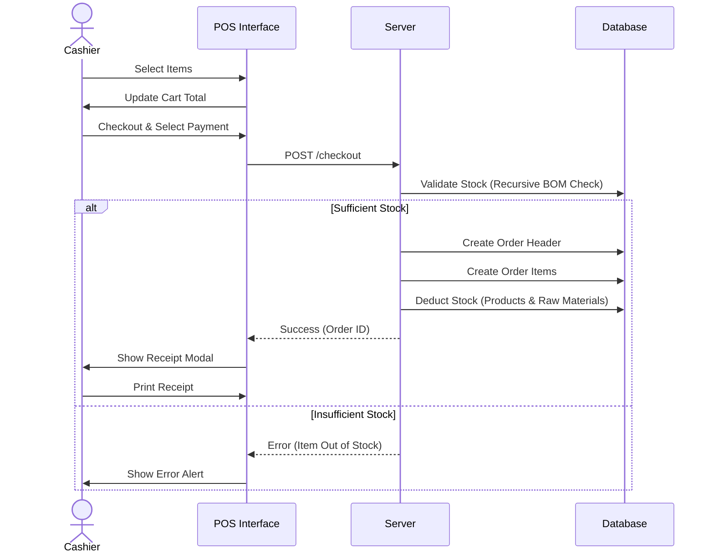
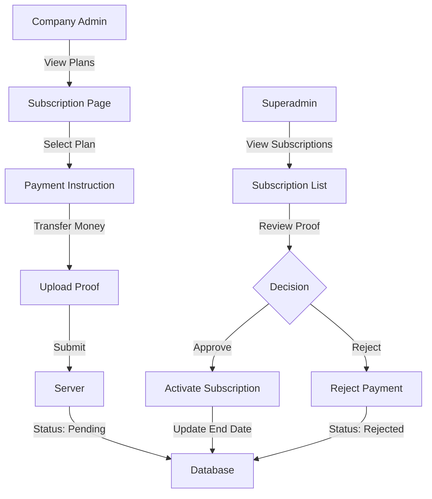

# Product Requirements Document (PRD) - Liosync Sistem

## 1. Project Overview
**Project Name:** Liosync Sistem
**Type:** Web-based Multi-Tenant Point of Sales (POS) & Inventory Management System
**Architecture:** SaaS Model (Superadmin > Company > Branch)

### Executive Summary
Liosync Sistem is a robust, multi-tenant POS solution designed for retail and F&B businesses. It enables detailed management of sales, inventory, and financials across multiple branches. The system supports a hierarchy where Superadmins manage the platform, Company Admins oversee their business and branches, and Branch Admins/Cashiers handle day-to-day operations.

## 2. Technology Stack
*   **Framework:** Laravel 12.0 (PHP 8.2+)
*   **Admin Panel:** Filament 4.5
*   **Frontend:** Blade Templates, Alpine.js, Tailwind CSS (via Vite)
*   **Database:** MariaDB/MySQL
*   **PDF Generation:** barryvdh/laravel-dompdf
*   **Excel Export:** maatwebsite/excel
*   **Role Management:** spatie/laravel-permission

## 3. User Roles & Permissions

| Role | Responsibility | Key Features Access |
| :--- | :--- | :--- |
| **Superadmin** | Platform Owner | Manage Companies (Create/Delete/Login As), Subscription Plans, Global Bank Settings, Verify Subscription Payments. |
| **Company Admin** | Business Owner | Manage Company Profile, Manage Branches, Manage Company Users, Purchase/Renew Subscriptions, View Company Dashboard. |
| **Branch Admin** | Store Manager | Manage Items (Products/Raw Materials), Categories, Inventory (Restock/Adjust), Reports (Sales, Cashflow, P&L), Branch Settings. |
| **Cashier** | Front-line Staff | Access POS Interface, Process Transactions, Print Receipts, Manage Pending Orders. |

## 4. Key Features

### 4.1 Point of Sale (POS)
*   **Efficient Checkout:** Quick product selection via grid or search (name/barcode).
*   **Cart Management:** Add/remove items, adjust quantities, calculate totals and taxes dynamically.
*   **Pending Orders:** "Hold" orders (e.g., for restaurant tables) and resume them later.
*   **Receipt Printing:** Support for Thermal (Pos), Kitchen, and Table receipts.
*   **Order Cancellation:** Ability to cancel pending orders.

### 4.2 Inventory & Product Management
*   **Unified Item Management:** Handle both "Products" (sellable) and "Raw Materials" (consumable) in one interface.
*   **Bill of Materials (BOM):** Link Products to Raw Materials (recipes) for automatic stock deduction upon sale.
*   **Stock Transactions:** Detailed history of all stock movements (adjustments, sales, restocks).
*   **Restocking:** Record incoming stock/purchases with cost tracking.
*   **Import/Export:** Bulk import items via Excel template; export current inventory.

### 4.3 Financial Management & Reporting
*   **Cashflow Management:** Track cash in/out manually (expenses, petty cash) and automatically (sales).
*   **Profit & Loss (P&L):** Report on revenue vs. COGS (Cost of Goods Sold).
*   **Sales Reports:** Daily transaction logs, product performance analysis.
*   **Inventory Reports:** Current valuation and stock levels.
*   **Export:** Generate PDF and Excel reports for offline analysis.

### 4.4 Multi-Tenancy & Subscriptions
*   **Company & Branch Hierarchy:** Strict data isolation between companies and branches.
*   **Context Switching:** Superadmins can "impersonate" Company Admins for support; Company Admins can switch between their branches.
*   **Subscription System:**
    *   **Plans:** Defined by Superadmin (price, duration, accuracy).
    *   **Payment:** Offline Bank Transfer flow. Companies upload proof of payment.
    *   **Verification:** Superadmin reviews and approves/rejects payments.
    *   **Enforcement:** Branch features are locked if the subscription expires.

## 5. System Flows

### 5.1 POS Transaction Flow

### 5.2 Subscription Purchase Flow

## 6. Database Schema Overview
*   **Companies/Branches:** Core tenants.
*   **Users:** Linked to Company/Branch, with Roles.
*   **Items:** `is_raw_material`, `track_stock`, `cogs`.
*   **ItemRecipes:** Maps Product -> Raw Materials (Quantity).
*   **Orders:** Sales headers (`total`, `payment_method`).
*   **OrderItems:** Line items linked to Orders.
*   **StockTransactions:** Ledger for all inventory changes (`type`: sale, adjustment, restock).
*   **Cashflow:** Records for financial tracking (`type`: in/out).
*   **Subscriptions:** Tracks plan validity periods for companies.

## 7. Future Roadmap
*   **Kitchen Display System (KDS):** Digital order viewing in kitchen.
*   **Customer Loyalty Program:** Points and redemption.
*   **Offline Mode:** PWA capabilities for internet outages.
