# JuicePOS Cashier System - Detailed Flow Diagrams

## Table of Contents
1. [System Architecture](#system-architecture)
2. [Complete User Journey Flow](#complete-user-journey-flow)
3. [Page Wireframes](#page-wireframes)
4. [Detailed Business Logic Flows](#detailed-business-logic-flows)
5. [State Diagrams](#state-diagrams)
6. [API Sequence Diagrams](#api-sequence-diagrams)
7. [Database Schema](#database-schema)
8. [Component Architecture](#component-architecture)

---

## System Architecture

### High-Level Architecture


### Request-Response Flow


---

## Complete User Journey Flow

### Master Flow Diagram


### Login Flow Detail


---

## Page Wireframes

### 1. Login Page Wireframe

```mermaid
flowchart TB
    subgraph LOGIN_PAGE["Login Page (/login) - 100% Width"]
        direction LR
        subgraph LEFT_PANEL["Left Panel - 60% - Branding"]
            LOGO["Logo: 🥤 JuicePOS<br/>━━━━━━━━━━<br/>Point of Sale System"]
            SLOGAN["Slogan: Streamline Your Juice Business"]
        end

        subgraph RIGHT_PANEL["Right Panel - 40% - Login Form"]
            FORM_HEADER["Login to Your Account"]
            EMAIL_INPUT["┌─────────────────────────────┐<br/>│ 📧 Email Address            │<br/>└─────────────────────────────┘"]
            PASSWORD_INPUT["┌─────────────────────────────┐<br/>│ 🔒 Password                  │<br/>└─────────────────────────────┘"]
            REMEMBER["☑ Remember me    Forgot password?"]
            LOGIN_BTN["┌─────────────────────────────┐<br/>│      🚀 LOGIN               │<br/>└─────────────────────────────┘"]
            DIVIDER["━━━━━━━━━ OR ━━━━━━━━━"]
            SOCIAL["  🟢 Google    🔵 Facebook  "]
        end
    end

    style LOGO fill:#4caf50,color:#fff
    style LOGIN_BTN fill:#4caf50,color:#fff
    style LEFT_PANEL fill:#e8f5e9
    style RIGHT_PANEL fill:#fff
```

### 2. POS Page Wireframe

```mermaid
flowchart TB
    subgraph POS["POS Page (/pos) - Full Screen"]
        direction TB

        subgraph HEADER["Top Header - 64px"]
            LOGO["🥤 JuicePOS"]
            SEARCH["┌─────────────────────────────────┐<br/>│🔍 Search item name or code (Alt+S)│<br/>└─────────────────────────────────┘"]
            USER["👤 John Doe<br/>Cashier"]
        end

        subgraph MAIN["Main Content - Flex Row"]
            direction LR

            subgraph LEFT["Left Panel - 70% - Product Catalog"]
                CATEGORIES["[All Items] 🍹Juices 🍨Smoothies 🥗Bowls"]
                PRODUCTS_GRID["┌─────────┐ ┌─────────┐ ┌─────────┐<br/>│🥤       │ │🍊       │ │🥝       │<br/>│Orange   │ │Mango    │ │Kiwi     │<br/>│$5.00    │ │$6.50    │ │$5.50    │<br/>└─────────┘ └─────────┘ └─────────┘<br/>┌─────────┐ ┌─────────┐ ┌─────────┐<br/>│🍓       │ │🥭       │ │🍌       │<br/>│Strawberry│ │Papaya   │ │Banana   │<br/>│$6.00    │ │$7.00    │ │$4.50    │<br/>└─────────┘ └─────────┘ └─────────┘"]
            end

            subgraph RIGHT["Right Panel - 30% - Current Order"]
                ORDER_HEADER["🧾 Order #NEW      [Dine In ▼]"]
                ACTIONS["[👤 Customer] [📝 Note] [🗑️ Clear]"]

                CART_ITEMS["┌──────────────────────────────────┐<br/>│🥤 Orange Juice              [- 1 +] $5.00│<br/>├──────────────────────────────────┤<br/>│🍊 Mango Smoothie            [- 2 +] $13.00│<br/>├──────────────────────────────────┤<br/>│🥝 Kiwi Blast                [- 1 +] $5.50│<br/>└──────────────────────────────────┘"]

                TOTALS["Subtotal:     $23.50<br/>Tax (8%):      $1.88<br/>━━━━━━━━━━━━━━━━━━<br/>TOTAL:        $25.38"]

                CHECKOUT_BTN["┌──────────────────────────────────┐<br/>│       💳 CHECKOUT (F12)          │<br/>└──────────────────────────────────┘"]
            end
        end
    end

    style HEADER fill:#263238,color:#fff
    style CATEGORIES fill:#4caf50,color:#fff
    style CHECKOUT_BTN fill:#4caf50,color:#fff
    style TOTALS fill:#fff3e0
    style LEFT fill:#f5f5f5
    style RIGHT fill:#fff
```

### 3. Payment Modal Wireframe

```mermaid
flowchart TB
    subgraph MODAL["Payment Modal - Centered - 500px"]
        MODAL_HEADER["┌────────────────────────────────────┤<br/>│ Payment Details              [✕] │<br/>└────────────────────────────────────"]

        MODAL_BODY["<br>    ┌────────────────────────────┐<br/>    │                            │<br/>    │      TOTAL DUE             │<br/>    │        $25.38              │<br/>    │                            │<br/>    └────────────────────────────┘<br/><br/>    Payment Method<br/>    ┌───────┐ ┌───────┐ ┌───────┐<br/>    │ 💵   │ │ 📱   │ │ 💳   │<br/>    │ Cash │ │ QRIS │ │Debit │<br/>    └───────┘ └───────┘ └───────┘<br/><br/>    ┌────────────────────────────┐<br/>    │ Cash Received               │<br/>    │ ┌────────────────────────┐  │<br/>    │ │ $30.00                 │  │<br/>    │ └────────────────────────┘  │<br/>    └────────────────────────────┘<br/><br/>    ┌────────────────────────────┐<br/>    │ 💱 Change Return      $4.62 │<br/>    └────────────────────────────┘<br/><br/>    🖨️ Print Receipt?     [🔘 ON]<br/>"]

        MODAL_FOOTER["┌──────────────────┬─────────────────────┐<br/>│     Cancel       │   Finalize Payment  │<br/>└──────────────────┴─────────────────────┘"]
    end

    style MODAL_HEADER fill:#37474f,color:#fff
    style MODAL_FOOTER fill:#fff
```

### 4. Dashboard Wireframe

```mermaid
flowchart TB
    subgraph DASH["Admin Dashboard (/admin)"]
        direction TB

        subgraph NAV["Sidebar Navigation - 250px"]
            LOGO["🥤 JuicePOS"]
            MENU["📊 Dashboard<br/>📦 Products<br/>📦 Raw Materials<br/>📈 Sales Reports<br/>⚙️ Settings<br/>🚪 Logout"]
        end

        subgraph CONTENT["Main Content"]
            HEADER["Daily Performance Dashboard    📅 Jan 15, 2026"]

            METRICS["┌─────────────┐ ┌─────────────┐ ┌─────────────┐ ┌─────────────┐<br/>│💵 Revenue  │ │🛒 Orders   │ │🥤 Items    │ │📊 Avg Order│<br/>│ $1,250.00   │ │     45      │ │    120      │ │   $27.78    │<br/>│ ▲12.5%      │ │  Today      │ │  Sold       │ │            │<br/>└─────────────┘ └─────────────┘ └─────────────┘ └─────────────┘"]

            CHARTS["┌─────────────────────────────────┬─────────────────────────────────┐<br/>│ Top Selling Items               │ Recent Stock Usage (BOM)       │<br/>├─────────────────────────────────┼─────────────────────────────────┤<br/>│ 🥤 Orange Juice    25  $125.00  │ 🍊 Oranges        50 pcs  OUT │<br/>│ 🍊 Mango Smoothie  20  $130.00  │ 🥛 Milk            5 L    OUT │<br/>│ 🥝 Kiwi Blast      18  $99.00   │ 🧈 Sugar          2 kg   LOW │<br/>│ 🍓 Strawberry      15  $90.00   │ 🥤 Cups            100 pcs OK │<br/>└─────────────────────────────────┴─────────────────────────────────┘"]
        end
    end

    style NAV fill:#263238,color:#fff
    style MENU fill:#37474f,color:#fff
    style METRICS fill:#e3f2fd
    style CHARTS fill:#fff
```

### 5. Products Management Wireframe

```mermaid
flowchart TB
    subgraph PRODUCTS["Products Management (/admin/products)"]
        direction TB

        subgraph NAV["Sidebar Navigation"]
            LOGO["🥤 JuicePOS"]
            MENU["📊 Dashboard<br/>📦 Products ✅<br/>📦 Raw Materials<br/>📈 Sales Reports<br/>⚙️ Settings"]
        end

        subgraph CONTENT["Main Content"]
            HEADER["Inventory Management     [+ Add New Product]"]

            STATS["┌─────────┐ ┌─────────┐ ┌─────────┐ ┌─────────┐<br/>│ Total   │ │ Active  │ │ Out of  │ │ Low     │<br/>│   25    │ │   22    │ │   1     │ │   2     │<br/>│ Products│ │ Items   │ │ Stock   │ │ Stock   │<br/>└─────────┘ └─────────┘ └─────────┘ └─────────┘"]

            SEARCH_FILTER["┌────────────────────────────────┐<br/>│🔍 Search products...        │<br/>└────────────────────────────────┘<br/>Category: [All ▼]    Status: [All ▼]"]

            TABLE["┌────────────────────────────────────────────────────────────────────┐<br/>│ Product │ Category │ Price  │ Stock │ Status │ Actions          │<br/>├────────────────────────────────────────────────────────────────────┤<br/>│🥤 Orange│ Juices   │ $5.00  │ 45    │✅Active│ [✏️] [🗑️]       │<br/>│  Juice  │          │        │ cups  │        │                  │<br/>├────────────────────────────────────────────────────────────────────┤<br/>│🍊 Mango │ Smoothies│ $6.50  │ 0     │⚠️Out   │ [✏️] [🗑️]       │<br/>│Smoothie│          │        │ cups  │ ofStock│                  │<br/>├────────────────────────────────────────────────────────────────────┤<br/>│🥝 Kiwi  │ Juices   │ $5.50  │ 8     │🟡Low   │ [✏️] [🗑️]       │<br/>│ Blast  │          │        │ cups  │ Stock  │                  │<br/>└────────────────────────────────────────────────────────────────────┘"]

            PAGINATION["◀ Previous  [1] [2] [3] ... [10]  Next ▶"]
        end
    end

    style NAV fill:#263238,color:#fff
    style MENU fill:#37474f,color:#fff
    style HEADER fill:#4caf50,color:#fff
    style STATS fill:#e3f2fd
    style TABLE fill:#fff
```

### 6. Product Create/Edit Form Wireframe

```mermaid
flowchart TB
    subgraph PRODUCT_FORM["Product Form (/admin/products/create or /edit)"]
        direction TB

        HEADER["Create New Product" or "Edit Product: Orange Juice"]

        FORM["┌──────────────────────────────────────────────────────────┐<br/>│                                                                  │<br/>│  Product Information                                              │<br/>│  ─────────────────────                                          │<br/>│                                                                  │<br/>│  Product Name *                                                   │<br/>│  ┌────────────────────────────────────────────────────────────┐    │<br/>│  │ Orange Juice                                              │    │<br/>│  └────────────────────────────────────────────────────────────┘    │<br/>│                                                                  │<br/>│  Category *              Price *                                 │<br/>│  ┌────────────────┐     ┌────────────────────────────────────┐       │<br/>│  │ Juices       ▼│     │ $5.00                              │       │<br/>│  └────────────────┘     └────────────────────────────────────┘       │<br/>│                                                                  │<br/>│  Product Image                                                    │<br/>│  ┌────────────────────────────────────────────────────────────┐    │<br/>│  │  📷 Upload Image                                          │    │<br/>│  │  ┌────────────────┐                                        │    │<br/>│  │  │                │  [Remove]                             │    │<br/>│  │  │  200x200       │                                        │    │<br/>│  │  │  Preview       │                                        │    │<br/>│  │  └────────────────┘                                        │    │<br/>│  └────────────────────────────────────────────────────────────┘    │<br/>│                                                                  │<br/>│  Status              Is Active? ☑                                 │<br/>│                                                                  │<br/>│  ─────────────────────────────────────────────────────────────  │<br/>│                                                                  │<br/>│  Recipe (BOM) - Raw Materials Required                          │<br/>│  ─────────────────────────────────────────                     │<br/>│                                                                  │<br/>│  [+ Add Material]                                                │<br/>│                                                                  │<br/>│  ┌────────────────────────────────────────────────────────────┐  │<br/>│  │ 🍊 Oranges              [Quantity] 2 [Unit] pcs           │  │<br/>│  │                                               [🗑️ Remove] │  │<br/>│  ├────────────────────────────────────────────────────────────┤  │<br/>│  │ 🥛 Milk                 [Quantity] 0.3 [Unit] L            │  │<br/>│  │                                               [🗑️ Remove] │  │<br/>│  ├────────────────────────────────────────────────────────────┤  │<br/>│  │ 🧈 Sugar               [Quantity] 1 [Unit] tbsp           │  │<br/>│  │                                               [🗑️ Remove] │  │<br/>│  └────────────────────────────────────────────────────────────┘  │<br/>│                                                                  │<br/>│  [+ Add Another Material]                                        │<br/>│                                                                  │<br/>└──────────────────────────────────────────────────────────┘"]

        ACTIONS["┌──────────────┬─────────────────────┐<br/>│   Cancel     │   💾 Save Product    │<br/>└──────────────┴─────────────────────┘"]
    end

    style HEADER fill:#4caf50,color:#fff
    style ACTIONS fill:#fff
```

### 7. Raw Materials / Inventory Wireframe

```mermaid
flowchart TB
    subgraph MATERIALS["Raw Materials (/admin/raw-materials)"]
        direction TB

        subgraph NAV["Sidebar Navigation"]
            LOGO["🥤 JuicePOS"]
            MENU["📊 Dashboard<br/>📦 Products<br/>📦 Raw Materials ✅<br/>📈 Sales Reports<br/>⚙️ Settings"]
        end

        subgraph CONTENT["Main Content"]
            HEADER["Inventory (Raw Materials)     [+ Add New Material]"]

            STATS["┌─────────┐ ┌─────────┐ ┌─────────┐ ┌─────────┐<br/>│ Total   │ │ In Stock│ │ Out of  │ │ Low     │<br/>│   18    │ │   14    │ │   2     │ │   2     │<br/>│ Items   │ │ Items   │ │ Stock   │ │ Stock   │<br/>└─────────┘ └─────────┘ └─────────┘ └─────────┘"]

            TABLE["┌─────────────────────────────────────────────────────────────────────────┐<br/>│ Material Name           │ Current Stock │ Min Level│ Status   │ Actions│<br/>├─────────────────────────────────────────────────────────────────────────┤<br/>│📦 Oranges                │ 150 pcs        │ 50 pcs    │✅ Good    │[✏️]    │<br/>├─────────────────────────────────────────────────────────────────────────┤<br/>│🥛 Milk                    │ 2 L            │ 10 L      │🔴 Out     │[✏️][📦]│<br/>│                          │                │           │of Stock   │        │<br/>├─────────────────────────────────────────────────────────────────────────┤<br/>│🧈 Sugar                   │ 0.8 kg         │ 2 kg      │🟡 Low     │[✏️][📦]│<br/>│                          │                │           │Stock     │        │<br/>├─────────────────────────────────────────────────────────────────────────┤<br/>│🥤 Plastic Cups            │ 45 pcs         │ 100 pcs   │🟡 Low     │[✏️][📦]│<br/>│                          │                │           │Stock     │        │<br/>└─────────────────────────────────────────────────────────────────────────┘"]

            LEGEND["✅ Good  🔴 Out of Stock  🟡 Low Stock  📦 Restock"]
        end
    end

    style NAV fill:#263238,color:#fff
    style MENU fill:#37474f,color:#fff
    style HEADER fill:#4caf50,color:#fff
    style STATS fill:#e3f2fd
    style TABLE fill:#fff
```

### 8. Restock Modal Wireframe

```mermaid
flowchart TB
    subgraph RESTOCK["Restock Modal"]
        MODAL_HEADER["┌────────────────────────────────────┤<br/>│ Restock: Oranges              [✕] │<br/>└────────────────────────────────────"]

        MODAL_BODY["<br/>    ┌────────────────────────────────┐<br/>    │ Current Stock:  2 pcs          │<br/>    │ Min Stock Level: 50 pcs          │<br/>    └────────────────────────────────┘<br/><br/>    Quantity to Add *<br/>    ┌────────────────────────────────┐<br/>    │ 100                              │<br/>    └────────────────────────────────┘<br/>    New Stock: 102 pcs<br/><br/>    Supplier<br/>    ┌────────────────────────────────┐<br/>    │ Fresh Farms Inc.                │<br/>    └────────────────────────────────┘<br/><br/>    Unit Cost<br/>    ┌────────────────────────────────┐<br/>    │ $0.50 per pcs                   │<br/>    └────────────────────────────────┘<br/>    Total Cost: $50.00<br/><br/>    Notes<br/>    ┌────────────────────────────────┐<br/>    │ Weekly restock                  │<br/>    └────────────────────────────────┘"]

        MODAL_FOOTER["┌──────────────────┬─────────────────────┐<br/>│     Cancel       │   ✅ Add Stock        │<br/>└──────────────────┴─────────────────────┘"]
    end

    style MODAL_HEADER fill:#37474f,color:#fff
```

### 9. Sales Reports Wireframe

```mermaid
flowchart TB
    subgraph REPORTS["Sales Reports (/admin/reports)"]
        direction TB

        subgraph NAV["Sidebar Navigation"]
            LOGO["🥤 JuicePOS"]
            MENU["📊 Dashboard<br/>📦 Products<br/>📦 Raw Materials<br/>📈 Sales Reports ✅<br/>⚙️ Settings"]
        end

        subgraph CONTENT["Main Content"]
            HEADER["Sales Reports"]

            FILTERS["┌────────────────────────────────────────────────────────────────┐<br/>│ 📅 Date Range: [Jan 1, 2026] to [Jan 15, 2026]                    │<br/>│ 📊 Report Type: [Revenue ▼]  📥 Export: [CSV ▼] [Generate]        │<br/>└────────────────────────────────────────────────────────────────┘"]

            SUMMARY["┌─────────────────┐ ┌─────────────────┐ ┌─────────────────┐<br/>│ Total Revenue   │ │ Orders          │ │ Avg Order       │<br/>│ $18,750.00      │ │ 456             │ │ $41.12          │<br/>│ ▲ +15.3%        │ │ ▲ +8.2%         │ │ ▲ +6.5%         │<br/>└─────────────────┘ └─────────────────┘ └─────────────────┘"]

            CHART["┌────────────────────────────────────────────────────────────────┐<br/>│                          Revenue Chart (Jan 1-15)                   │<br/>│  $500│                                             ╱╲                │<br/>│  $400│                                    ╱╲      ╱  ╲              │<br/>│  $300│                            ╱╲      ╱  ╲    ╱    ╲            │<br/>│  $200│                    ╱╲      ╱  ╲    ╱    ╲  ╱      ╲         │<br/>│  $100│            ╱╲      ╱  ╲    ╱    ╲  ╱      ╲╱        ╲       │<br/>│    $0└────────┴────────┴────────┴────────┴────────┴────────┴──────│<br/>│        Jan 1   Jan 4   Jan 7   Jan 10  Jan 13  Jan 15             │<br/>└────────────────────────────────────────────────────────────────┘"]

            TABLE["┌────────────────────────────────────────────────────────────────┐<br/>│ Date                    │ Orders │ Revenue │ Items │ Avg Order │<br/>├────────────────────────────────────────────────────────────────┤<br/>│ Jan 15, 2026            │ 32     │ $1,320   │ 89    │ $41.25    │<br/>├────────────────────────────────────────────────────────────────┤<br/>│ Jan 14, 2026            │ 28     │ $1,150   │ 76    │ $41.07    │<br/>├────────────────────────────────────────────────────────────────┤<br/>│ Jan 13, 2026            │ 35     │ $1,435   │ 95    │ $41.00    │<br/>├────────────────────────────────────────────────────────────────┤<br/>│ ...                     │ ...    │ ...      │ ...   │ ...       │<br/>└────────────────────────────────────────────────────────────────┘"]
        end
    end

    style NAV fill:#263238,color:#fff
    style MENU fill:#37474f,color:#fff
    style HEADER fill:#4caf50,color:#fff
    style SUMMARY fill:#e3f2fd
    style CHART fill:#fff
```

### 10. Settings Page Wireframe

```mermaid
flowchart TB
    subgraph SETTINGS["Settings (/admin/settings)"]
        direction TB

        subgraph NAV["Sidebar Navigation"]
            LOGO["🥤 JuicePOS"]
            MENU["📊 Dashboard<br/>📦 Products<br/>📦 Raw Materials<br/>📈 Sales Reports<br/>⚙️ Settings ✅"]
        end

        subgraph CONTENT["Main Content"]
            HEADER["System Settings"]

            TABS["[General] [Payment] [Tax] [Users] [Receipts]"]

            FORM["┌────────────────────────────────────────────────────────────────┐<br/>│                                                                  │<br/>│  Store Information                                               │<br/>│  ─────────────────                                            │<br/>│                                                                  │<br/>│  Store Name *                                                    │<br/>│  ┌────────────────────────────────────────────────────────────┐    │<br/>│  │ JuicePOS                                                  │    │<br/>│  └────────────────────────────────────────────────────────────┘    │<br/>│                                                                  │<br/>│  Store Address                                                   │<br/>│  ┌────────────────────────────────────────────────────────────┐    │<br/>│  │ 123 Juice Street, Beverage City, BC 12345                 │    │<br/>│  └────────────────────────────────────────────────────────────┘    │<br/>│                                                                  │<br/>│  Store Phone                         Store Email                 │<br/>│  ┌──────────────────┐                ┌──────────────────────┐      │<br/>│  │ +1 555-0123      │                │ info@juicepos.com   │      │<br/>│  └──────────────────┘                └──────────────────────┘      │<br/>│                                                                  │<br/>│  Store Logo                                                      │<br/>│  ┌────────────────────────────────────────────────────────────┐    │<br/>│  │  [📷 Browse...]  Current: [juicepos-logo.png] [Remove]     │    │<br/>│  └────────────────────────────────────────────────────────────┘    │<br/>│                                                                  │<br/>│  Currency         Timezone                                      │<br/>│  ┌────────────┐   ┌────────────────────┐                        │<br/>│  │ USD ($)   ▼│   │ UTC ▼             │                        │<br/>│  └────────────┘   └────────────────────┘                        │<br/>│                                                                  │<br/>└──────────────────────────────────────────────────────────┘"]

            ACTIONS["┌────────────────────────────────────────────────┐<br/>│                 💾 Save Settings                     │<br/>└────────────────────────────────────────────────┘"]
        end
    end

    style NAV fill:#263238,color:#fff
    style MENU fill:#37474f,color:#fff
    style HEADER fill:#4caf50,color:#fff
    style ACTIONS fill:#4caf50,color:#fff
```

### 11. Receipt Wireframe

```mermaid
flowchart TB
    subgraph RECEIPT["Thermal Receipt (80mm width)"]
        RECEIPT_CONTENT["<br>    ╔════════════════════════════════════════╗<br/>    ║          🥤 JUICEPOS                   ║<br/>    ║       123 Juice Street                ║<br/>    ║       Tel: +1 555-0123                ║<br/>    ╠════════════════════════════════════════╣<br/>    ║                                        ║<br/>    ║  Order #: ORD-0001                     ║<br/>    ║  Date: Jan 15, 2026 14:30             ║<br/>    ║  Cashier: John Doe                     ║<br/>    ║                                        ║<br/>    ╠════════════════════════════════════════╣<br/>    ║  ITEM              QTY    PRICE        ║<br/>    ║  ──────────────────────────────        ║<br/>    ║  Orange Juice       2     $10.00       ║<br/>    ║  Mango Smoothie     1     $6.50        ║<br/>    ║  Kiwi Blast         1     $5.50        ║<br/>    ║                                        ║<br/>    ╠════════════════════════════════════════╣<br/>    ║  Subtotal:               $22.00        ║<br/>    ║  Tax (8%):                $1.76        ║<br/>    ║  ─────────────────────────────         ║<br/>    ║  TOTAL:                  $23.76        ║<br/>    ║                                        ║<br/>    ║  Paid: CASH               $25.00        ║<br/>    ║  Change:                 $1.24         ║<br/>    ║                                        ║<br/>    ╠════════════════════════════════════════╣<br/>    ║     Thank you for visiting!           ║<br/>    ║        Please come again!              ║<br/>    ╚════════════════════════════════════════╝"]
    end

    style RECEIPT_CONTENT fill:#fff
```

---

## Detailed Business Logic Flows

### 1. Complete POS Checkout Flow


### 2. Product Recipe (BOM) Calculation Flow

```mermaid
flowchart TD
    START([Product Sold]) --> INPUT[Input: Order Details]

    INPUT --> PARSE{Parse Order Items}

    PARSE -->|For Each Item| GET_PRODUCT[Get Product Data]

    GET_PRODUCT --> GET_RECIPES[SELECT * FROM product_recipes<br/>WHERE product_id = ?]

    GET_RECIPES --> RECIPES_EXIST{Recipes Found?}

    RECIPES_EXISTS -->|No| NEXT_ITEM[Skip to Next Item]
    RECIPES_EXISTS -->|Yes| LOOP_MATERIALS[Loop Through Materials]

    LOOP_MATERIALS -->|For Each Material| GET_MATERIAL_INFO[Get RawMaterial Info]

    GET_MATERIAL_INFO --> CALCULATE[Calculate:<br/>qty_needed = order_qty × recipe_qty]

    CALCULATE --> CHECK_STOCK{Check Availability<br/>current_stock >= qty_needed}

    CHECK_STOCK -->|No| ERROR_INSUFFICIENT[Error: Insufficient Stock<br/>Material: {name}<br/>Available: {current_stock}<br/>Needed: {qty_needed}]

    ERROR_INSUFFICIENT --> STOP([❌ Fail Transaction])

    CHECK_STOCK -->|Yes| CREATE_TRANSACTION[INSERT StockTransaction:<br/>- raw_material_id<br/>- type = 'out'<br/>- quantity = qty_needed<br/>- description = 'Sold in Order #X'<br/>- reference_id = order_id]

    CREATE_TRANSACTION --> UPDATE_RAW[UPDATE raw_materials:<br/>current_stock = current_stock - qty_needed]

    UPDATE_RAW --> MORE_MATERIALS{More Materials?}

    MORE_MATERIALS -->|Yes| LOOP_MATERIALS
    MORE_MATERIALS -->|No| NEXT_ITEM

    NEXT_ITEM --> MORE_ITEMS{More Items?}

    MORE_ITEMS -->|Yes| PARSE
    MORE_ITEMS -->|No| COMPLETE([✅ All Stock Deducted])

    style ERROR_INSUFFICIENT fill:#ffcdd2
    style STOP fill:#ffcdd2
    style COMPLETE fill:#c8e6c9
```

### 3. Stock Alert & Notification Flow

```mermaid
flowchart TD
    START([Stock Changed]) --> TRIGGER[Stock Transaction Created]

    TRIGGER --> GET_MATERIAL[Get RawMaterial Data]

    GET_MATERIAL --> CALC_THRESHOLD[Calculate Threshold Status]

    CALC_THRESHOLD --> CHECK_CRITICAL{current_stock <= 0?}

    CHECK_CRITICAL -->|Yes| CRITICAL_ALERT[🔴 CRITICAL: Out of Stock!]
    CRITICAL_ALERT --> NOTIFY_CRITICAL[Notify:<br/>- Dashboard Alert<br/>- Email Notification<br/>- Update Status Badge]

    CHECK_CRITICAL -->|No| CHECK_LOW{current_stock <= min_stock_level?}

    CHECK_LOW -->|Yes| LOW_ALERT[🟡 WARNING: Low Stock]
    LOW_ALERT --> NOTIFY_LOW[Notify:<br/>- Dashboard Warning<br/>- Update Status Badge]

    CHECK_LOW -->|No| NORMAL_STATUS[✅ Normal Stock Level]
    NORMAL_STATUS -> UPDATE_OK[Update Status: Good]

    NOTIFY_CRITICAL --> UPDATE_MATERIAL[UPDATE raw_materials<br/>status = 'out_of_stock']
    NOTIFY_LOW --> UPDATE_MATERIAL
    UPDATE_OK --> UPDATE_MATERIAL

    UPDATE_MATERIAL --> LOG[Log to Stock History]
    LOG --> DASHBOARD_UPDATE[Update Dashboard Widgets]
    DASHBOARD_UPDATE --> COMPLETE([Done])

    style CRITICAL_ALERT fill:#ffcdd2
    style LOW_ALERT fill:#fff9c4
    style NORMAL_STATUS fill:#c8e6c9
    style COMPLETE fill:#c8e6c9
```

### 4. Product Management CRUD Flow

```mermaid
flowchart TD
    START([Admin Access]) --> NAVIGATE[Navigate to Products]

    NAVIGATE --> LIST_PAGE[Products List Page]

    LIST_PAGE --> ACTION{Choose Action}

    ACTION -->|Create| CREATE_FLOW
    ACTION -->|Edit| EDIT_FLOW
    ACTION -->|Delete| DELETE_FLOW
    ACTION -->|View Recipe| RECIPE_FLOW
    ACTION -->|Search/Filter| FILTER_FLOW

    FILTER_FLOW[Apply Filters] --> LIST_PAGE

    CREATE_FLOW[Click 'Add New'] --> CREATE_FORM[Show Create Form]
    CREATE_FORM --> FILL_DETAILS[Fill Product Details]
    FILL_DETAILS --> UPLOAD_IMAGE{Upload Image?}
    UPLOAD_IMAGE -->|Yes| HANDLE_UPLOAD[Upload & Store Path]
    UPLOAD_IMAGE -->|No| ADD_RECIPE
    HANDLE_UPLOAD --> ADD_RECIPE[Add Recipe Materials]
    ADD_RECIPE --> SUBMIT_CREATE[Click Save]
    SUBMIT_CREATE --> VALIDATE_CREATE{Validate}
    VALIDATE_CREATE -->|Invalid| SHOW_ERROR_CREATE[Show Errors]
    SHOW_ERROR_CREATE --> CREATE_FORM
    VALIDATE_CREATE -->|Valid| INSERT_PRODUCT[INSERT Product]
    INSERT_PRODUCT --> INSERT_RECIPES[INSERT ProductRecipes]
    INSERT_RECIPES --> SUCCESS_CREATE[✅ Product Created]
    SUCCESS_CREATE --> LIST_PAGE

    EDIT_FLOW[Click Edit on Product] --> EDIT_FORM[Show Edit Form<br/>Pre-filled]
    EDIT_FORM --> UPDATE_DETAILS[Modify Details]
    UPDATE_DETAILS --> UPDATE_IMAGE{Change Image?}
    UPDATE_IMAGE -->|Yes| HANDLE_UPDATE[Upload New / Remove Old]
    UPDATE_IMAGE -->|No| UPDATE_RECIPE
    HANDLE_UPDATE --> UPDATE_RECIPE[Update Recipe Materials]
    UPDATE_RECIPE --> SUBMIT_EDIT[Click Update]
    SUBMIT_EDIT --> VALIDATE_EDIT{Validate}
    VALIDATE_EDIT -->|Invalid| SHOW_ERROR_EDIT[Show Errors]
    SHOW_ERROR_EDIT --> EDIT_FORM
    VALIDATE_EDIT -->|Valid| UPDATE_PRODUCT[UPDATE Product]
    UPDATE_PRODUCT --> UPDATE_RECIPES_DB[DELETE old + INSERT new Recipes]
    UPDATE_RECIPES_DB --> SUCCESS_EDIT[✅ Product Updated]
    SUCCESS_EDIT --> LIST_PAGE

    DELETE_FLOW[Click Delete] --> CONFIRM_DELETE{Confirm?}
    CONFIRM_DELETE -->|No| LIST_PAGE
    CONFIRM_DELETE -->|Yes| CHECK_ORDERS{Has Orders?}
    CHECK_ORDERS -->|Yes| ERROR_DELETE[❌ Cannot Delete<br/>Has order history]
    ERROR_DELETE --> LIST_PAGE
    CHECK_ORDERS -->|No| SOFT_DELETE[Soft Delete Product]
    SOFT_DELETE --> SUCCESS_DELETE[✅ Product Deleted]
    SUCCESS_DELETE --> LIST_PAGE

    RECIPE_FLOW[Click 'View Recipe'] --> RECIPE_MODAL[Show BOM/Recipe Modal]
    RECIPE_MODAL --> SHOW_MATERIALS[Display Required Materials]
    SHOW_MATERIALS --> CLOSE_RECIPE[Close Modal]
    CLOSE_RECIPE --> LIST_PAGE

    style SUCCESS_CREATE fill:#c8e6c9
    style SUCCESS_EDIT fill:#c8e6c9
    style SUCCESS_DELETE fill:#c8e6c9
    style ERROR_DELETE fill:#ffcdd2
    style SHOW_ERROR_CREATE fill:#ffcdd2
    style SHOW_ERROR_EDIT fill:#ffcdd2
```

### 5. Restock / Purchase Flow

```mermaid
flowchart TD
    START([Staff Notice Low Stock]) --> NAVIGATE[Navigate to Raw Materials]

    NAVIGATE --> LIST_PAGE[Stock List Page]

    LIST_PAGE --> IDENTIFY_LOW{Identify Low Stock Items}
    IDENTIFY_LOW --> CLICK_RESTOCK[Click '📦 Restock' Button]

    CLICK_RESTOCK --> RESTOCK_MODAL[Show Restock Modal]

    RESTOCK_MODAL --> DISPLAY_CURRENT[Display Current Stock<br/>Display Min Level]

    DISPLAY_CURRENT --> ENTER_QTY[Enter Quantity to Add]

    ENTER_QTY --> CALC_NEW[Calculate New Stock<br/>new_total = current + added]

    CALC_NEW --> ENTER_SUPPLIER[Enter Supplier Info<br/>(optional)]

    ENTER_SUPPLIER --> ENTER_COST{Enter Unit Cost?}
    ENTER_COST -->|Yes| INPUT_COST[Input Cost per Unit]
    ENTER_COST -->|No| CALC_TOTAL
    INPUT_COST --> CALC_TOTAL[Calculate Total Cost<br/>total = qty × unit_cost]

    CALC_TOTAL --> ADD_NOTES{Add Notes?}
    ADD_NOTES -->|Yes| INPUT_NOTES[Enter Notes]
    ADD_NOTES -->|No| CONFIRM_RESTOCK
    INPUT_NOTES --> CONFIRM_RESTOCK

    CONFIRM_RESTOCK[Click 'Add Stock'] --> SEND_REQUEST[POST /admin/raw-materials/{id}/restock]

    SEND_REQUEST --> SERVER_VALIDATE[Validate Request]

    SERVER_VALIDATE -->|Invalid| ERROR_RESTOCK[Show Error]
    ERROR_RESTOCK --> RESTOCK_MODAL

    SERVER_VALIDATE -->|Valid| BEGIN_TRANS[Begin DB Transaction]

    BEGIN_TRANS --> CREATE_TRANS_IN[CREATE StockTransaction:<br/>- type = 'in'<br/>- quantity = added_qty<br/>- supplier = supplier<br/>- unit_cost, total_cost<br/>- description]

    CREATE_TRANS_IN --> UPDATE_STOCK_IN[UPDATE raw_materials:<br/>current_stock = current_stock + added_qty]

    UPDATE_STOCK_IN --> CHECK_THRESHOLD{Check New Status}

    CHECK_THRESHOLD -->|Still Low| KEEP_LOW[Keep: Low Stock Status]
    CHECK_THRESHOLD -->|Normal| UPDATE_NORMAL[Update: Good Status]

    KEEP_LOW --> COMMIT_RESTOCK
    UPDATE_NORMAL --> COMMIT_RESTOCK[Commit Transaction]

    COMMIT_RESTOCK --> SUCCESS_RESTOCK[✅ Stock Added Successfully]
    SUCCESS_RESTOCK --> LIST_PAGE[Refresh List]

    style SUCCESS_RESTOCK fill:#c8e6c9
    style ERROR_RESTOCK fill:#ffcdd2
    style KEEP_LOW fill:#fff9c4
    style UPDATE_NORMAL fill:#c8e6c9
```

---

## State Diagrams

### 1. Cart State Diagram

```mermaid
stateDiagram-v2
    [*] --> Empty: Initialize

    Empty --> HasItems: Add First Item
    HasItems --> HasItems: Add More Items
    HasItems --> HasItems: Update Quantity (+/-)
    HasItems --> Empty: Clear Cart / Remove Last

    HasItems --> CheckoutModal: Click Checkout

    CheckoutModal --> CheckoutModal: Change Payment Method
    CheckoutModal --> CheckoutModal: Enter Cash Amount
    CheckoutModal --> Processing: Click Finalize

    Processing --> Success: Order Complete
    Processing --> Failed: Validation Error

    Failed --> CheckoutModal: Retry
    Success --> Empty: Clear Cart

    note right of Empty
        cart = []
        total = 0
    end note

    note right of HasItems
        cart.length > 0
        total > 0
    end note

    note right of CheckoutModal
        showPaymentModal = true
        paymentMethod selected
    end note

    note right of Processing
        isLoading = true
        Waiting for API
    end note
```

### 2. Order State Diagram

```mermaid
stateDiagram-v2
    [*] --> Pending: Order Created

    Pending --> Processing: Payment Started
    Pending --> Cancelled: Timeout / Cancel

    Processing --> Completed: Payment Success
    Processing --> Failed: Payment Failed
    Processing --> Cancelled: Cancelled

    Completed --> Refunded: Refund Requested
    Completed --> [*]

    Failed --> Pending: Retry Payment
    Failed --> Cancelled: Give Up

    Cancelled --> [*]

    Refunded --> [*]

    note right of Pending
        status = 'pending'
        Awaiting payment
    end note

    note right of Processing
        status = 'processing'
        Payment in progress
    end note

    note right of Completed
        status = 'completed'
        Stock deducted
        Receipt generated
    end note

    note right of Cancelled
        status = 'cancelled'
        No changes made
    end note
```

### 3. Product State Diagram

```mermaid
stateDiagram-v2
    [*] --> Draft: Create New

    Draft --> Active: Publish / Save
    Draft --> [*]: Discard

    Active --> Inactive: Deactivate
    Active --> OutOfStock: Stock = 0

    Inactive --> Active: Reactivate
    Inactive --> [*]: Delete

    OutOfStock --> Active: Restocked
    OutOfStock --> Inactive: Manual Deactivate

    note right of Draft
        is_active = null/false
        Not visible in POS
    end note

    note right of Active
        is_active = true
        Visible in POS
        Can be ordered
    end note

    note right of Inactive
        is_active = false
        Hidden from POS
    end note

    note right of OutOfStock
        is_active = true
        But shows "Out of Stock"
        Cannot add to cart
    end note
```

### 4. Stock Transaction State Diagram

```mermaid
stateDiagram-v2
    [*] --> StockIn: Purchase/Restock

    StockIn --> Available: Stock Added
    StockIn --> [*]: Cancelled

    Available --> StockOut: Product Sold
    Available --> StockAdjust: Manual Adjustment

    StockOut --> LowStock: Below Min Level
    StockOut --> OutOfStock: Stock = 0

    LowStock --> Available: Restocked
    LowStock --> OutOfStock: Depleted

    OutOfStock --> Available: Restocked

    StockAdjust --> Available: Adjustment Made
    StockAdjust --> LowStock: Decreased
    StockAdjust --> OutOfStock: Decreased to 0

    note right of StockIn
        type = 'in'
        Increases current_stock
    end note

    note right of StockOut
        type = 'out'
        Decreases current_stock
        (BOM deduction)
    end note

    note right of StockAdjust
        type = 'adjustment'
        Manual correction
        + or - quantity
    end note

    note right of LowStock
        current_stock <= min_stock_level
        Warning triggered
    end note

    note right of OutOfStock
        current_stock <= 0
        Critical alert
    end note
```

---

## API Sequence Diagrams

### 1. Product Search API

```mermaid
sequenceDiagram
    actor User
    participant UI as POS UI
    participant API as API Endpoint
    participant DB as Database

    User->>UI: Types in search box
    UI->>UI: Debounce input (300ms)

    alt Numeric Input (Barcode)
        UI->>API: GET /api/products/search?barcode=12345
        API->>DB: SELECT * FROM products WHERE barcode = '12345'
        DB-->>API: Product record
        API-->>UI: JSON {product}
        UI->>User: Highlight product in grid
    else Text Input (Name)
        UI->>UI: Filter local products array
        UI->>User: Show filtered results
    end
```

### 2. Complete Checkout API Sequence

```mermaid
sequenceDiagram
    actor Cashier
    participant UI as POS Frontend
    participant Route as /checkout
    participant Ctrl as PosController
    participant DB as Database
    participant BOM as BOM Service

    Cashier->>UI: Click Checkout
    UI->>Cashier: Show Payment Modal

    Cashier->>UI: Select Cash, Enter $30
    UI->>Cashier: Show Change: $4.62

    Cashier->>UI: Click Finalize Payment
    UI->>Route: POST /checkout<br/>{items, total, payment_method, cash_received}

    Route->>Ctrl: checkout(Request)

    Ctrl->>Ctrl: Validate Request
    alt Validation Fails
        Ctrl-->>UI: 422 Validation Error
        UI->>Cashier: Show Error Message
    else Validation Passes
        Ctrl->>DB: BEGIN TRANSACTION

        Ctrl->>DB: INSERT INTO orders<br/>(user_id, total_amount, payment_method, status)
        DB-->>Ctrl: order_id = 1001

        loop For Each Cart Item
            Ctrl->>DB: INSERT INTO order_items<br/>(order_id, product_id, quantity, price, subtotal)

            Ctrl->>BOM: processStockDeduction(product_id, quantity)

            BOM->>DB: Get recipes for product
            DB-->>BOM: [{raw_material_id, quantity_required}]

            loop For Each Recipe Material
                BOM->>BOM: Calculate needed = order_qty × recipe_qty

                BOM->>DB: Check current_stock
                DB-->>BOM: current_stock

                alt Stock Insufficient
                    BOM->>Ctrl: Throw InsufficientStockException
                    Ctrl->>DB: ROLLBACK
                    Ctrl-->>UI: 500 Error: Insufficient Stock
                    UI->>Cashier: Show Error
                else Stock Available
                    BOM->>DB: INSERT INTO stock_transactions<br/>(type='out', quantity, reference_id)
                    BOM->>DB: UPDATE raw_materials<br/>SET current_stock = current_stock - needed
                end
            end
        end

        Ctrl->>DB: COMMIT TRANSACTION
        Ctrl-->>UI: 200 OK {order_id: 1001, success: true}

        UI->>Cashier: Show Success Toast
        UI->>UI: Clear Cart

        alt print_receipt = true
            UI->>UI: Generate Receipt HTML
            UI->>Cashier: Open Print Dialog
        end
    end
```

### 3. Product CRUD API Sequence

```mermaid
sequenceDiagram
    actor Admin
    participant UI as Admin UI
    participant Route as /admin/products
    participant Ctrl as AdminProductController
    participant DB as Database
    participant Storage as File Storage

    Admin->>UI: Click "Add New Product"
    UI->>Admin: Show Create Form

    Admin->>UI: Fill Form + Upload Image
    UI->>UI: Validate Client-side

    Admin->>UI: Click Save
    UI->>Route: POST /admin/products<br/>{product_data, image, recipes[]}

    Route->>Ctrl: store(Request)

    Ctrl->>Ctrl: Validate Request
    alt Validation Fails
        Ctrl-->>UI: Redirect back with errors
        UI->>Admin: Show Validation Errors
    else Validation Passes
        Ctrl->>DB: BEGIN TRANSACTION

        alt Image Uploaded
            Ctrl->>Storage: store('image', 'public/products')
            Storage-->>Ctrl: image_path
        end

        Ctrl->>DB: INSERT INTO products<br/>(category_id, name, price, image, is_active)
        DB-->>Ctrl: product_id = 50

        loop For Each Recipe
            Ctrl->>DB: INSERT INTO product_recipes<br/>(product_id, raw_material_id, quantity_required)
        end

        Ctrl->>DB: COMMIT

        Ctrl-->>UI: Redirect to /admin/products
        UI->>Admin: Show Success Message
    end
```

### 4. Restock API Sequence

```mermaid
sequenceDiagram
    actor Staff
    participant UI as Admin UI
    participant Route as /admin/raw-materials/{id}/restock
    participant Ctrl as AdminRawMaterialController
    participant DB as Database

    Staff->>UI: Click "Restock" on Material
    UI->>Staff: Show Restock Modal

    Staff->>UI: Enter Qty, Supplier, Cost
    Staff->>UI: Click "Add Stock"
    UI->>Route: POST /admin/raw-materials/15/restock<br/>{quantity: 100, supplier: "Fresh Farms", unit_cost: 0.50}

    Route->>Ctrl: restock($id, Request)

    Ctrl->>DB: Get RawMaterial
    DB-->>Ctrl: {id: 15, name: "Oranges", current_stock: 2}

    Ctrl->>Ctrl: Validate Request
    Ctrl->>Ctrl: Calculate total_cost = quantity × unit_cost

    Ctrl->>DB: BEGIN TRANSACTION

    Ctrl->>DB: INSERT INTO stock_transactions<br/>(raw_material_id, type='in', quantity=100, supplier, unit_cost, total_cost)

    Ctrl->>DB: UPDATE raw_materials<br/>SET current_stock = 102<br/>WHERE id = 15

    Ctrl->>DB: COMMIT

    Ctrl->>Ctrl: Check new stock level
    alt current_stock > min_stock_level
        Ctrl->>DB: Update status = 'good'
    else current_stock <= min_stock_level
        Ctrl->>DB: Update status = 'low_stock'
    end

    Ctrl-->>UI: Redirect back with success
    UI->>Staff: Show Success: "Added 100 pcs of Oranges"

    UI->>UI: Refresh Stock List
    UI->>Staff: Update: Current Stock = 102 pcs
```

---

## Database Schema

### Complete ER Diagram

```mermaid
erDiagram
    %% Users
    USER ||--o{ ORDER : places
    USER ||--o{ ACTIVITY_LOG : creates

    %% Categories
    CATEGORY ||--o{ PRODUCT : contains

    %% Products
    PRODUCT }o--o{ RAW_MATERIAL : "requires (BOM)"
    PRODUCT }|--|| PRODUCT_RECIPE : "has recipe"
    PRODUCT ||--o{ ORDER_ITEM : "ordered in"

    %% Raw Materials
    RAW_MATERIAL }|--|| PRODUCT_RECIPE : "used in"
    RAW_MATERIAL ||--o{ STOCK_TRANSACTION : tracks

    %% Orders
    ORDER ||--o{ ORDER_ITEM : contains
    ORDER ||--o{ STOCK_TRANSACTION : references

    %% Order Items
    ORDER_ITEM }|--|| PRODUCT : references

    %% Stock Transactions
    STOCK_TRANSACTION }|--|| RAW_MATERIAL : references

    %% Settings
    SETTING ||--o{ SETTING : manages

    USER {
        bigint id PK
        string name
        string email UK
        string password
        enum role "admin,manager,cashier"
        boolean is_active
        timestamp email_verified_at
        timestamps created_at, updated_at
    }

    CATEGORY {
        bigint id PK
        string name
        string type "juice,smoothie,bowl,add-on"
        string icon
        string color
        boolean is_active
        integer sort_order
        timestamps created_at, updated_at
    }

    PRODUCT {
        bigint id PK
        bigint category_id FK
        string barcode UK
        string sku UK
        string name
        string description
        decimal price
        string image
        boolean is_active
        decimal cost_price
        decimal profit_margin
        timestamps created_at, updated_at
        soft_deletes deleted_at
    }

    RAW_MATERIAL {
        bigint id PK
        string name
        string unit "pcs,kg,L,tbsp"
        decimal current_stock
        decimal min_stock_level
        decimal max_stock_level
        enum status "good,low_stock,out_of_stock"
        timestamps created_at, updated_at
    }

    PRODUCT_RECIPE {
        bigint id PK
        bigint product_id FK
        bigint raw_material_id FK
        decimal quantity_required
        timestamps created_at, updated_at
        UK (product_id, raw_material_id)
    }

    ORDER {
        bigint id PK
        bigint user_id FK
        string order_number UK
        decimal subtotal
        decimal tax_amount
        decimal total_amount
        enum payment_method "cash,qris,debit"
        enum status "pending,processing,completed,cancelled,refunded"
        decimal cash_received
        decimal change_return
        boolean print_receipt
        string customer_name
        string notes
        timestamps created_at, updated_at
        soft_deletes deleted_at
    }

    ORDER_ITEM {
        bigint id PK
        bigint order_id FK
        bigint product_id FK
        integer quantity
        decimal price
        decimal subtotal
        timestamps created_at, updated_at
    }

    STOCK_TRANSACTION {
        bigint id PK
        bigint raw_material_id FK
        enum type "in,out,adjustment"
        decimal quantity
        enum status "good,low_stock,out_of_stock"
        string supplier
        decimal unit_cost
        decimal total_cost
        string description
        string reference_type "order,manual,restock"
        bigint reference_id
        timestamps created_at, updated_at
    }

    SETTING {
        bigint id PK
        string key UK
        json value
        string type "string,number,json,boolean"
        string group "general,payment,tax,receipt"
        timestamps created_at, updated_at
    }

    ACTIVITY_LOG {
        bigint id PK
        bigint user_id FK
        string action
        string model_type
        bigint model_id
        json changes
        string ip_address
        string user_agent
        timestamps created_at
    }
```

---

## Component Architecture

### Frontend Component Tree

```mermaid
flowchart TD
    ROOT[Root Component<br/>layouts/app.blade.php]

    ROOT --> AUTH[Auth Layout]
    ROOT --> ADMIN[Admin Layout]
    ROOT --> POS[POS Layout]

    AUTH --> LOGIN[Login Page]

    ADMIN --> SIDEBAR[Sidebar Navigation]
    ADMIN --> HEADER[Admin Header]
    ADMIN --> CONTENT[Content Area]

    CONTENT --> DASHBOARD[Dashboard Page]
    CONTENT --> PRODUCTS[Products Management]
    CONTENT --> MATERIALS[Raw Materials]
    CONTENT --> REPORTS[Sales Reports]
    CONTENT --> SETTINGS[Settings Page]

    DASHBOARD --> KPIS[KPI Cards]
    DASHBOARD --> TOP_PRODUCTS[Top Products Widget]
    DASHBOARD --> STOCK_WIDGET[Stock Usage Widget]

    PRODUCTS --> PRODUCTS_TABLE[Products Table]
    PRODUCTS --> PRODUCTS_STATS[Stats Cards]
    PRODUCTS --> PRODUCT_FORM[Product Form]
    PRODUCTS --> RECIPE_FORM[Recipe Form]

    MATERIALS --> MATERIALS_TABLE[Materials Table]
    MATERIALS --> MATERIALS_STATS[Stock Stats]
    MATERIALS --> MATERIAL_FORM[Material Form]
    MATERIALS --> RESTOCK_FORM[Restock Modal]

    REPORTS --> REPORT_FILTERS[Report Filters]
    REPORTS --> REVENUE_CHART[Revenue Chart]
    REPORTS --> PRODUCTS_CHART[Products Chart]
    REPORTS --> PAYMENTS_CHART[Payments Chart]

    SETTINGS --> SETTINGS_TABS[Settings Tabs]
    SETTINGS_TABS --> GENERAL_TAB[General Settings]
    SETTINGS_TABS --> PAYMENT_TAB[Payment Settings]
    SETTINGS_TABS --> TAX_TAB[Tax Settings]
    SETTINGS_TABS --> RECEIPT_TAB[Receipt Settings]

    POS --> POS_HEADER[POS Header]
    POS --> POS_MAIN[POS Main Content]

    POS_HEADER --> SEARCH[Search Bar]
    POS_HEADER --> USER_INFO[Cashier Info]
    POS_HEADER --> NOTIFICATIONS[Notifications]

    POS_MAIN --> CATALOG[Product Catalog]
    POS_MAIN --> CART_PANEL[Cart Panel]

    CATALOG --> CATEGORIES[Category Tabs]
    CATALOG --> PRODUCTS_GRID[Product Grid]

    CART_PANEL --> ORDER_HEADER[Order Header]
    CART_PANEL --> CART_ITEMS[Cart Items]
    CART_PANEL --> TOTALS[Order Totals]
    CART_PANEL --> CHECKOUT_BTN[Checkout Button]

    CHECKOUT_BTN --> PAYMENT_MODAL[Payment Modal]
    PAYMENT_MODAL --> PAYMENT_METHODS[Payment Methods]
    PAYMENT_MODAL --> CASH_INPUT[Cash Input]
    PAYMENT_MODAL --> CHANGE_DISPLAY[Change Display]
    PAYMENT_MODAL --> RECEIPT_TOGGLE[Receipt Toggle]
    PAYMENT_MODAL --> CONFIRM_BTN[Finalize Button]

    PAYMENT_MODAL --> RECEIPT[Receipt Component]
    RECEIPT --> RECEIPT_PREVIEW[Receipt Preview]
    RECEIPT --> PRINT_BUTTON[Print Button]

    style ROOT fill:#1565c0,color:#fff
    style AUTH fill:#4caf50,color:#fff
    style ADMIN fill:#ff9800,color:#fff
    style POS fill:#9c27b0,color:#fff
```

### Backend Architecture Layer Diagram

```mermaid
flowchart TB
    subgraph PRESENTATION["Presentation Layer"]
        ROUTES["routes/web.php<br/>routes/api.php"]
        VIEWS["Blade Views"]
    end

    subgraph APPLICATION["Application Layer"]
        CONTROLLERS["Controllers<br/>- PosController<br/>- AdminProductController<br/>- AdminRawMaterialController<br/>- DashboardController<br/>- SettingsController<br/>- ReportsController<br/>- ReceiptController"]
        MIDDLEWARE["Middleware<br/>- Auth<br/>- CSRF<br/>- RoleCheck"]
        REQUESTS["Form Requests<br/>- CheckoutRequest<br/>- ProductRequest<br/>- MaterialRequest"]
    end

    subgraph DOMAIN["Domain Layer"]
        MODELS["Eloquent Models<br/>- User<br/>- Category<br/>- Product<br/>- RawMaterial<br/>- ProductRecipe<br/>- Order<br/>- OrderItem<br/>- StockTransaction<br/>- Setting"]
        SERVICES["Services<br/>- BOMService<br/>- StockService<br/>- ReceiptService<br/>- ReportService"]
    end

    subgraph INFRASTRUCTURE["Infrastructure Layer"]
        DATABASE["Database<br/>MariaDB"]
        STORAGE["File Storage<br/>/storage/app/public"]
        CACHE["Cache<br/>Redis/File"]
        QUEUE["Queue<br/>Redis/Database"]
    end

    ROUTES --> MIDDLEWARE
    MIDDLEWARE --> CONTROLLERS
    CONTROLLERS --> REQUESTS
    CONTROLLERS --> SERVICES
    SERVICES --> MODELS
    MODELS --> DATABASE
    VIEWS --> CONTROLLERS

    CONTROLLERS --> STORAGE
    SERVICES --> CACHE
    SERVICES --> QUEUE

    style PRESENTATION fill:#e3f2fd
    style APPLICATION fill:#fff3e0
    style DOMAIN fill:#c8e6c9
    style INFRASTRUCTURE fill:#f3e5f5
```

---

## File Structure

```
d:\Cashier/
├── app/
│   ├── Http/
│   │   ├── Controllers/
│   │   │   ├── Auth/
│   │   │   │   ├── LoginController.php
│   │   │   │   └── RegisteredUserController.php
│   │   │   ├── PosController.php
│   │   │   ├── AdminProductController.php
│   │   │   ├── AdminRawMaterialController.php
│   │   │   ├── DashboardController.php
│   │   │   ├── SettingsController.php
│   │   │   ├── ReportsController.php
│   │   │   ├── StockTransactionController.php
│   │   │   ├── ReceiptController.php
│   │   │   └── ApiController.php
│   │   ├── Middleware/
│   │   │   ├── Authenticate.php
│   │   │   ├── RedirectIfAuthenticated.php
│   │   │   └── RoleMiddleware.php
│   │   └── Requests/
│   │       ├── CheckoutRequest.php
│   │       ├── ProductRequest.php
│   │       ├── MaterialRequest.php
│   │       └── RestockRequest.php
│   ├── Models/
│   │   ├── User.php
│   │   ├── Category.php
│   │   ├── Product.php
│   │   ├── RawMaterial.php
│   │   ├── ProductRecipe.php
│   │   ├── Order.php
│   │   ├── OrderItem.php
│   │   ├── StockTransaction.php
│   │   └── Setting.php
│   └── Services/
│       ├── BOMService.php
│       ├── StockService.php
│       ├── ReceiptService.php
│       └── ReportService.php
├── resources/
│   ├── views/
│   │   ├── layouts/
│   │   │   ├── app.blade.php
│   │   │   ├── admin.blade.php
│   │   │   └── auth.blade.php
│   │   ├── auth/
│   │   │   └── login.blade.php
│   │   ├── pos/
│   │   │   └── index.blade.php
│   │   ├── receipt/
│   │   │   └── print.blade.php
│   │   └── admin/
│   │       ├── dashboard.blade.php
│   │       ├── settings/
│   │       │   └── index.blade.php
│   │       ├── products/
│   │       │   ├── index.blade.php
│   │       │   ├── create.blade.php
│   │       │   ├── edit.blade.php
│   │       │   └── recipe.blade.php
│   │       ├── raw-materials/
│   │       │   ├── index.blade.php
│   │       │   ├── create.blade.php
│   │       │   ├── edit.blade.php
│   │       │   └── restock.blade.php
│   │       ├── reports/
│   │       │   ├── index.blade.php
│   │       │   ├── revenue.blade.php
│   │       │   ├── products.blade.php
│   │       │   └── payments.blade.php
│   │       └── stock-transactions/
│   │           └── index.blade.php
│   ├── css/
│   │   └── app.css
│   └── js/
│       └── app.js
├── routes/
│   ├── web.php
│   └── api.php
├── database/
│   ├── migrations/
│   └── seeders/
└── tests/
    ├── Feature/
    │   ├── PosTest.php
    │   ├── ProductCRUDTest.php
    │   ├── MaterialCRUDTest.php
    │   ├── RestockTest.php
    │   └── ReceiptTest.php
    └── Unit/
        ├── BOMServiceTest.php
        └── StockServiceTest.php
```

---

*Document Version: 2.0 - Enhanced*
*Last Updated: January 11, 2026*
*Author: Claude Code*
